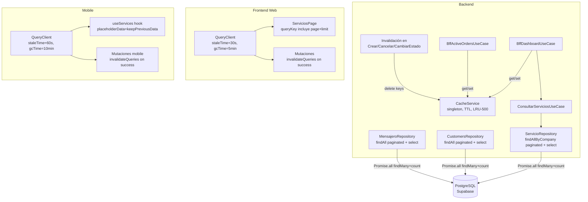

# Design Document — api-performance-optimization

## Overview

La optimización de rendimiento de la API de TracKing aborda tres frentes complementarios sin cambios de infraestructura ni migraciones de base de datos:

1. **Caché en memoria (backend):** Un `CacheService` singleton con TTL configurable y límite de 500 entradas. Los use-cases del BFF (`bff-dashboard`, `bff-active-orders`) lo consultan antes de ir a la base de datos. Las mutaciones de servicios invalidan las entradas relevantes.

2. **Paginación server-side:** Los endpoints `GET /api/services`, `GET /api/customers` y `GET /api/mensajeros` aceptan `page` y `limit` como query params. Los repositorios ejecutan `findMany` + `count` en paralelo con `Promise.all` y retornan un `PaginatedResponse`.

3. **React Query (frontend web y mobile):** Configuración de `staleTime` y `gcTime` en los `QueryClient` de ambas apps. Las mutaciones invalidan las queries relacionadas. La página de servicios incluye `page` y `limit` en la `queryKey`.

---

## Architecture



**Decisiones de diseño:**

- `CacheService` es un módulo NestJS global (`@Global()`) para evitar importarlo en cada módulo que lo necesite.
- La invalidación de caché se hace en los use-cases de mutación (crear, cancelar, cambiar estado), no en el repositorio, para mantener la lógica de negocio en la capa de aplicación.
- La paginación usa `page` (base 1) y `limit` en lugar de `offset` en la API pública, pero el repositorio calcula `skip = (page - 1) * limit` internamente.
- El `CacheService` usa un `Map` con timestamps de inserción para implementar evicción LRU-simple (elimina las entradas más antiguas cuando supera 500).
- No se usa `@nestjs/cache-manager` ni Redis para mantener cero dependencias de infraestructura nueva.

---

## Components and Interfaces

### Backend: CacheService

```typescript
// src/infrastructure/cache/cache.service.ts
@Injectable()
export class CacheService {
  private readonly store = new Map<string, { value: unknown; expiresAt: number; insertedAt: number }>();
  private readonly MAX_ENTRIES = 500;

  get<T>(key: string): T | null
  set(key: string, value: unknown, ttlSeconds: number): void
  delete(key: string): void
  deleteByPrefix(prefix: string): void  // para invalidación por patrón
  private evictOldestIfNeeded(): void
}
```

### Backend: PaginationDto

```typescript
// src/core/dto/pagination.dto.ts
export class PaginationDto {
  @IsOptional() @IsInt() @Min(1) @Type(() => Number)
  page?: number = 1;

  @IsOptional() @IsInt() @Min(1) @Max(100) @Type(() => Number)
  limit?: number = 20;
}
```

### Backend: PaginatedResponse

```typescript
// src/core/types/paginated-response.type.ts
export interface PaginatedResponse<T> {
  data: T[];
  total: number;
  page: number;
  limit: number;
}
```

### Backend: ServicioRepository (cambios)

```typescript
// Nuevo método paginado con select explícito
async findAllByCompanyPaginated(
  company_id: string,
  filters: { status?: ServiceStatus; courier_id?: string },
  pagination: { page: number; limit: number },
): Promise<PaginatedResponse<ServiceTableRow>>

// select explícito excluye: notes_observations, statusHistory
// incluye: customer(id, name, phone), courier(id, user(id, name))
```

### Backend: CustomersRepository (cambios)

```typescript
async findAllPaginated(
  company_id: string,
  pagination: { page: number; limit: number },
): Promise<PaginatedResponse<CustomerTableRow>>

// select: id, name, phone, email, address, status, is_favorite, created_at
```

### Backend: MensajeroRepository (cambios)

```typescript
async findAllPaginated(
  company_id: string,
  pagination: { page: number; limit: number },
): Promise<PaginatedResponse<MensajeroTableRow>>

// user select: id, name, email, status
```

### Backend: BffDashboardUseCase (cambios)

```typescript
async execute(company_id: string) {
  const cacheKey = `bff:dashboard:${company_id}`;
  const cached = this.cache.get(cacheKey);
  if (cached) return cached;

  const result = await Promise.all([...]);
  this.cache.set(cacheKey, result, 30);
  return result;
}
```

### Frontend Web: queryClient.ts (cambios)

```typescript
export const queryClient = new QueryClient({
  defaultOptions: {
    queries: {
      retry: 1,
      refetchOnWindowFocus: false,
      staleTime: 30_000,   // 30 segundos
      gcTime: 300_000,     // 5 minutos
    },
  },
})
```

### Frontend Web: ServiciosPage (cambios)

```typescript
// queryKey incluye page y limit
const { data } = useQuery({
  queryKey: ['services', { page, limit, status, courier_id }],
  queryFn: () => servicesService.getAll({ page, limit, status, courier_id }),
})
```

### Mobile: AppProviders.tsx (cambios)

```typescript
const queryClient = new QueryClient({
  defaultOptions: {
    queries: {
      retry: 1,
      staleTime: 60_000,   // 60 segundos
      gcTime: 600_000,     // 10 minutos
    },
  },
});
```

### Mobile: useServices hook (migración a React Query)

```typescript
// Migrar de useState/useEffect manual a useQuery
export function useServices() {
  return useQuery({
    queryKey: ['courier-services'],
    queryFn: () => servicesApi.getAll(),
    placeholderData: keepPreviousData,
  });
}
```

---

## Data Models

No se requieren cambios en el schema de Prisma ni migraciones.

### ServiceTableRow (tipo de retorno del select explícito)

```typescript
interface ServiceTableRow {
  id: string;
  company_id: string;
  customer_id: string;
  courier_id: string | null;
  payment_method: PaymentMethod;
  payment_status: PaymentStatus;
  origin_address: string;
  destination_address: string;
  destination_name: string;
  package_details: string;
  delivery_price: number;
  product_price: number;
  total_price: number;
  status: ServiceStatus;
  assignment_date: Date | null;
  delivery_date: Date | null;
  created_at: Date;
  is_settled_courier: boolean;
  is_settled_customer: boolean;
  customer: { id: string; name: string; phone: string | null };
  courier: { id: string; user: { id: string; name: string } } | null;
}
```

### CustomerTableRow

```typescript
interface CustomerTableRow {
  id: string;
  name: string;
  phone: string | null;
  email: string | null;
  address: string;
  status: boolean;
  is_favorite: boolean;
  created_at: Date;
}
```

### Cache entry (interno)

```typescript
interface CacheEntry {
  value: unknown;
  expiresAt: number;   // Date.now() + ttl * 1000
  insertedAt: number;  // Date.now() — para evicción LRU
}
```

---

## Correctness Properties

*A property is a characteristic or behavior that should hold true across all valid executions of a system — essentially, a formal statement about what the system should do. Properties serve as the bridge between human-readable specifications and machine-verifiable correctness guarantees.*

### Property 1: Round-trip de caché

*For any* clave string y valor arbitrario con TTL > 0, almacenar el valor en el `CacheService` y recuperarlo inmediatamente debe retornar el mismo valor.

**Validates: Requirements 1.1**

---

### Property 2: Caché hit evita consultas a la base de datos

*For any* objeto de respuesta de dashboard almacenado en caché para un `company_id`, cuando `BffDashboardUseCase.execute` se invoca con ese `company_id`, debe retornar el objeto cacheado sin invocar ninguno de los use-cases de base de datos subyacentes.

**Validates: Requirements 1.3, 1.4**

---

### Property 3: Invalidación de caché por company_id

*For any* `company_id`, después de invocar la invalidación de caché de servicios, las claves `bff:dashboard:{company_id}` y `bff:active-orders:{company_id}` deben retornar `null` al consultarlas.

**Validates: Requirements 1.7**

---

### Property 4: Límite de 500 entradas en caché

*For any* conjunto de N > 500 entradas insertadas en el `CacheService`, el número total de entradas almacenadas no debe superar 500, y las entradas eliminadas deben ser las más antiguas.

**Validates: Requirements 1.8**

---

### Property 5: Cálculo correcto de skip/take en paginación

*For any* par válido `(page ≥ 1, 1 ≤ limit ≤ 100)`, el repositorio debe ser invocado con `take = limit` y `skip = (page - 1) * limit`.

**Validates: Requirements 2.2, 2.4, 2.5**

---

### Property 6: Forma del PaginatedResponse

*For any* par válido `(page, limit)`, el use-case debe retornar un objeto con exactamente los campos `data` (array), `total` (número ≥ 0), `page` (igual al input) y `limit` (igual al input).

**Validates: Requirements 2.3**

---

### Property 7: Validación de parámetros de paginación fuera de rango

*For any* valor de `page < 1` o `limit` fuera del rango `[1, 100]`, la validación del DTO debe rechazar la petición con HTTP 400.

**Validates: Requirements 2.1, 2.6**

---

### Property 8: Invalidación de queries en mutaciones (frontend web)

*For any* mutación exitosa de creación, edición o eliminación de servicios/clientes/mensajeros, `queryClient.invalidateQueries` debe ser invocado con las query keys relacionadas al recurso modificado.

**Validates: Requirements 3.5**

---

### Property 9: Query key incluye parámetros de paginación

*For any* par `(page, limit)` usado en la página de servicios, la `queryKey` del `useQuery` debe contener ambos valores, de modo que páginas distintas tengan entradas de caché independientes.

**Validates: Requirements 3.6**

---

### Property 10: Invalidación de queries en mutaciones (mobile)

*For any* actualización de estado de servicio exitosa en la app mobile, la query `['courier-services']` debe ser invalidada en el `QueryClient` mobile.

**Validates: Requirements 5.4**

---

## Error Handling

### CacheService

- `get` nunca lanza excepciones: si la clave no existe o expiró, retorna `null`.
- `set` con TTL ≤ 0 no almacena la entrada (no-op silencioso).
- La evicción de entradas antiguas es síncrona y ocurre dentro de `set` antes de insertar la nueva entrada.

### Paginación

- Valores inválidos de `page` o `limit` son rechazados por `ValidationPipe` global de NestJS antes de llegar al use-case. Retorna HTTP 400 con mensaje descriptivo de `class-validator`.
- Página fuera de rango (mayor al total de registros): retorna `data: []`, `total` correcto, HTTP 200. No es un error.
- `Promise.all([findMany, count])` — si cualquiera falla, el error se propaga normalmente al handler de excepciones de NestJS.

### React Query (frontend web y mobile)

- Los errores de red siguen el patrón existente: `isError` + `error` en cada `useQuery`.
- `invalidateQueries` en mutaciones: si la invalidación falla (caso raro), no bloquea la respuesta al usuario — React Query reintentará en el siguiente foco de ventana.
- `placeholderData: keepPreviousData` en mobile: si la query falla, se muestra el último dato conocido hasta que el usuario refresque manualmente.

---

## Testing Strategy

### Librería PBT

**Backend (NestJS/TypeScript):** [`fast-check`](https://github.com/dubzzz/fast-check) — ya presente en `devDependencies`.

### Tests del backend

Los tests se ubican en `TracKing-backend/specs/api-performance-optimization.spec.ts`.

**Property tests (fast-check, mínimo 100 iteraciones cada uno):**

```typescript
// Property 1: Round-trip de caché
// Feature: api-performance-optimization, Property 1: cache round-trip
it('CacheService: get después de set retorna el mismo valor', async () => {
  await fc.assert(
    fc.asyncProperty(
      fc.string({ minLength: 1 }),
      fc.anything(),
      fc.integer({ min: 1, max: 3600 }),
      async (key, value, ttl) => {
        cache.set(key, value, ttl);
        expect(cache.get(key)).toEqual(value);
      }
    ),
    { numRuns: 100 }
  );
});

// Property 2: Cache hit evita DB
// Feature: api-performance-optimization, Property 2: cache hit skips DB
it('BffDashboardUseCase: retorna caché sin llamar use-cases de DB', async () => {
  await fc.assert(
    fc.asyncProperty(
      fc.record({ pending_services: fc.array(fc.anything()), active_couriers: fc.array(fc.anything()), today_financial: fc.anything() }),
      fc.uuid(),
      async (cachedValue, companyId) => {
        mockCache.get.mockReturnValue(cachedValue);
        const result = await useCase.execute(companyId);
        expect(result).toEqual(cachedValue);
        expect(mockConsultarServicios.findAll).not.toHaveBeenCalled();
      }
    ),
    { numRuns: 100 }
  );
});

// Property 3: Invalidación de caché
// Feature: api-performance-optimization, Property 3: cache invalidation
it('CacheService: invalidar por prefijo elimina entradas relacionadas', async () => {
  await fc.assert(
    fc.asyncProperty(fc.uuid(), async (companyId) => {
      cache.set(`bff:dashboard:${companyId}`, { data: 1 }, 30);
      cache.set(`bff:active-orders:${companyId}`, { data: 2 }, 20);
      cache.deleteByPrefix(`bff:dashboard:${companyId}`);
      cache.deleteByPrefix(`bff:active-orders:${companyId}`);
      expect(cache.get(`bff:dashboard:${companyId}`)).toBeNull();
      expect(cache.get(`bff:active-orders:${companyId}`)).toBeNull();
    }),
    { numRuns: 100 }
  );
});

// Property 4: Límite de 500 entradas
// Feature: api-performance-optimization, Property 4: cache max 500 entries
it('CacheService: no supera 500 entradas', async () => {
  await fc.assert(
    fc.asyncProperty(
      fc.integer({ min: 501, max: 600 }),
      async (n) => {
        for (let i = 0; i < n; i++) cache.set(`key-${i}`, i, 60);
        expect(cache.size()).toBeLessThanOrEqual(500);
      }
    ),
    { numRuns: 100 }
  );
});

// Property 5: skip/take correcto
// Feature: api-performance-optimization, Property 5: pagination skip/take math
it('ServicioRepository: skip=(page-1)*limit, take=limit', async () => {
  await fc.assert(
    fc.asyncProperty(
      fc.integer({ min: 1, max: 1000 }),
      fc.integer({ min: 1, max: 100 }),
      async (page, limit) => {
        await repo.findAllByCompanyPaginated('company-id', {}, { page, limit });
        expect(mockPrisma.service.findMany).toHaveBeenCalledWith(
          expect.objectContaining({ take: limit, skip: (page - 1) * limit })
        );
      }
    ),
    { numRuns: 100 }
  );
});

// Property 6: Forma del PaginatedResponse
// Feature: api-performance-optimization, Property 6: paginated response shape
it('Use-case retorna PaginatedResponse con data, total, page, limit', async () => {
  await fc.assert(
    fc.asyncProperty(
      fc.integer({ min: 1, max: 100 }),
      fc.integer({ min: 1, max: 100 }),
      async (page, limit) => {
        const result = await useCase.findAll('company-id', {}, { page, limit });
        expect(result).toHaveProperty('data');
        expect(Array.isArray(result.data)).toBe(true);
        expect(result).toHaveProperty('total');
        expect(result.page).toBe(page);
        expect(result.limit).toBe(limit);
      }
    ),
    { numRuns: 100 }
  );
});

// Property 7: Validación de parámetros fuera de rango
// Feature: api-performance-optimization, Property 7: invalid pagination params rejected
it('PaginationDto: rechaza page < 1 o limit fuera de [1,100]', async () => {
  await fc.assert(
    fc.asyncProperty(
      fc.oneof(
        fc.record({ page: fc.integer({ max: 0 }), limit: fc.integer({ min: 1, max: 100 }) }),
        fc.record({ page: fc.integer({ min: 1 }), limit: fc.integer({ max: 0 }) }),
        fc.record({ page: fc.integer({ min: 1 }), limit: fc.integer({ min: 101 }) }),
      ),
      async ({ page, limit }) => {
        const errors = await validate(Object.assign(new PaginationDto(), { page, limit }));
        expect(errors.length).toBeGreaterThan(0);
      }
    ),
    { numRuns: 100 }
  );
});
```

**Unit tests (ejemplos concretos):**

- TTL expirado retorna `null` (con fake timers)
- Cache miss en BFF ejecuta consultas en paralelo y llama `cache.set` con TTL correcto (30s dashboard, 20s active-orders)
- Página fuera de rango retorna `data: []` con `total` correcto
- `findMany` y `count` se ejecutan en paralelo (`Promise.all`)
- Select explícito en `ServicioRepository` excluye `notes_observations` y `statusHistory`

### Tests del frontend web

Ubicación: `TracKing-frontend/src/` (junto a los archivos que modifican).

```typescript
// Property 8: Invalidación de queries en mutaciones
// Feature: api-performance-optimization, Property 8: mutation invalidates queries
it('Mutación de servicio invalida queries relacionadas', async () => {
  await fc.assert(
    fc.asyncProperty(fc.uuid(), async (serviceId) => {
      // ejecutar mutación exitosa
      // verificar queryClient.invalidateQueries(['services'])
    }),
    { numRuns: 100 }
  );
});

// Property 9: Query key incluye page y limit
// Feature: api-performance-optimization, Property 9: queryKey includes pagination
it('useQuery de servicios incluye page y limit en queryKey', async () => {
  await fc.assert(
    fc.asyncProperty(
      fc.integer({ min: 1, max: 100 }),
      fc.integer({ min: 1, max: 100 }),
      async (page, limit) => {
        // renderizar hook con page y limit
        // verificar que queryKey contiene ambos valores
      }
    ),
    { numRuns: 100 }
  );
});
```

**Smoke tests (configuración):**

- `queryClient.defaultOptions.queries.staleTime === 30_000`
- `queryClient.defaultOptions.queries.gcTime === 300_000`

### Tests del mobile

Ubicación: `TracKing-Mobile-/src/__tests__/services/`.

```typescript
// Property 10: Invalidación en mobile
// Feature: api-performance-optimization, Property 10: mobile mutation invalidates services query
it('Actualización de estado invalida query courier-services', async () => {
  await fc.assert(
    fc.asyncProperty(
      fc.uuid(),
      fc.constantFrom('ACCEPTED', 'IN_TRANSIT', 'DELIVERED'),
      async (serviceId, newStatus) => {
        // ejecutar mutación de cambio de estado
        // verificar invalidateQueries(['courier-services'])
      }
    ),
    { numRuns: 100 }
  );
});
```

**Smoke tests (configuración mobile):**

- `queryClient.defaultOptions.queries.staleTime === 60_000`
- `queryClient.defaultOptions.queries.gcTime === 600_000`
- `apiClient.defaults.timeout === 10_000` (existente, debe mantenerse)

### Balance unit/property tests

- **Property tests:** comportamiento del caché (round-trip, invalidación, límite), cálculo de paginación, validación de DTOs, invalidación de queries en mutaciones.
- **Unit tests:** TTL expirado, cache miss → DB call, páginas fuera de rango, selects explícitos en repositorios.
- No duplicar: si una propiedad cubre un caso, no escribir unit test adicional para el mismo.
- Mínimo **100 iteraciones** por property test (`numRuns: 100`).
