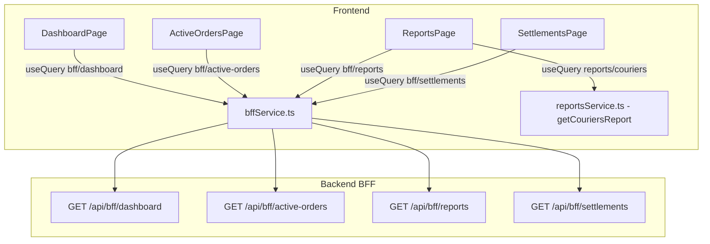

# Design Document — bff-web

## Overview

La migración BFF-Web tiene dos frentes: un fix puntual en el backend y la migración completa del frontend.

**Backend:** El `BffReportsQueryDto` declara `from`/`to` como `@IsOptional()`, pero el Requirement 5.3 exige que sean obligatorios. El fix es cambiar los decoradores a `@IsNotEmpty()` y actualizar `@ApiPropertyOptional` a `@ApiProperty`.

**Frontend:** Cuatro páginas hacen un total de 12 llamadas HTTP independientes. La migración las reemplaza por 4 llamadas a los endpoints BFF ya existentes en el backend, reduciendo la latencia percibida y simplificando la lógica de cada página.

El reporte de mensajeros (`/api/reports/couriers`) no tiene endpoint BFF equivalente y sigue siendo una llamada independiente en `ReportsPage`.

---

## Architecture



**Decisiones de diseño:**

- Se crea `bffService.ts` como servicio dedicado, en lugar de añadir métodos a los servicios existentes. Esto mantiene la separación de responsabilidades y facilita revertir la migración si fuera necesario.
- Los servicios originales (`servicesService`, `mensajerosService`, etc.) no se eliminan — siguen siendo usados por otras páginas y mutaciones.
- Las mutaciones (`assign`, `cancel`, `generateForCourier`) siguen usando los servicios originales; solo las queries de carga inicial migran al BFF.
- `ReportsPage` usa una query híbrida: BFF para services+financial, endpoint original para couriers.

---

## Components and Interfaces

### Nuevo: `bffService.ts`

```typescript
// src/services/bffService.ts
import { api } from '@/lib/axios'
import type { BffDashboardResponse, BffActiveOrdersResponse, BffReportsResponse, BffSettlementsResponse } from '@/types/bff'

export const bffService = {
  getDashboard(): Promise<BffDashboardResponse>,
  getActiveOrders(): Promise<BffActiveOrdersResponse>,
  getReports(params: { from: string; to: string }): Promise<BffReportsResponse>,
  getSettlements(params?: { courier_id?: string }): Promise<BffSettlementsResponse>,
}
```

### Fix: `bff-query.dto.ts` (backend)

```typescript
// ANTES
@IsOptional()
@IsDateString()
from?: string;

// DESPUÉS
@IsNotEmpty()
@IsDateString()
from: string;
```

### Páginas migradas

| Página | Queries eliminadas | Query nueva |
|--------|-------------------|-------------|
| `DashboardPage` | `services`, `mensajeros/activos`, `reports/financial` | `bff/dashboard` |
| `ActiveOrdersPage` | `services`, `mensajeros/activos` | `bff/active-orders` |
| `ReportsPage` | `reports/services`, `reports/financial` | `bff/reports` |
| `SettlementsPage` | `mensajeros/activos`, `liquidations/rules/active`, `liquidations/earnings` | `bff/settlements` |

`SettlementsPage` también usa `liquidations` (historial completo) que no está en el BFF — esa query permanece.

---

## Data Models

### Nuevos tipos BFF (`src/types/bff.ts`)

Los tipos actuales en `src/types/index.ts` están desalineados con las respuestas BFF. Se crean tipos dedicados en un archivo separado para no romper el código existente.

```typescript
// src/types/bff.ts

// ─── Shared ───────────────────────────────────────────────────────────────────

export interface BffPeriod {
  from: string
  to: string
}

export interface BffRevenue {
  total_services: number
  total_price: number
  total_delivery: number
  total_product: number
}

export interface BffPaymentMethodStat {
  method: string
  total: number
  count: number
}

export interface BffSettlementSummary {
  settled: { count: number; total_earned: number }
  unsettled: { count: number; total_earned: number }
}

// ─── Dashboard ────────────────────────────────────────────────────────────────

export interface BffTodayFinancial {
  period: BffPeriod
  revenue: BffRevenue
  by_payment_method: BffPaymentMethodStat[]
  settlements: BffSettlementSummary
}

export interface BffDashboardResponse {
  pending_services: Service[]       // import from @/types
  active_couriers: Mensajero[]      // import from @/types
  today_financial: BffTodayFinancial
}

// ─── Active Orders ────────────────────────────────────────────────────────────

export interface BffActiveOrdersResponse {
  services: Service[]
  available_couriers: Mensajero[]
}

// ─── Reports ──────────────────────────────────────────────────────────────────

export interface BffServicesByCourier {
  courier_id: string
  courier_name: string
  total_services: number
}

export interface BffServicesByStatus {
  status: string
  count: number
}

export interface BffServicesReport {
  period: BffPeriod
  by_status: BffServicesByStatus[]   // array, no Record
  by_courier: BffServicesByCourier[]
  avg_delivery_minutes: number
  cancellation: { rate: number; total: number }
}

export interface BffFinancialReport {
  period: BffPeriod
  revenue: BffRevenue                // revenue.total_price, no total_revenue
  by_payment_method: BffPaymentMethodStat[]
  settlements: BffSettlementSummary
}

export interface BffReportsResponse {
  services: BffServicesReport
  financial: BffFinancialReport
}

// ─── Settlements ──────────────────────────────────────────────────────────────

export interface BffActiveRule {
  id: string
  type: 'PERCENTAGE' | 'FIXED'
  value: number
  active: boolean
  created_at: string
}

export interface BffEarnings {
  total_settlements: number
  total_services: number             // no services_count
  total_earned: number
  settlements: Liquidation[]         // import from @/types
}

export interface BffSettlementsResponse {
  couriers: Mensajero[]
  active_rule: BffActiveRule | null
  earnings: BffEarnings
}
```

**Mapeo de campos desalineados:**

| Campo actual (frontend) | Campo BFF real | Ubicación |
|------------------------|----------------|-----------|
| `ServicesReport.by_status` → `Record<ServiceStatus, number>` | `BffServicesReport.by_status` → `BffServicesByStatus[]` | ReportsPage |
| `FinancialReport.total_revenue` | `BffFinancialReport.revenue.total_price` | DashboardPage, ReportsPage |
| `FinancialReport.services_count` | `BffFinancialReport.revenue.total_services` | ReportsPage |
| `LiquidationEarnings.services_count` | `BffEarnings.total_services` | SettlementsPage |
| `LiquidationRule.is_active` | `BffActiveRule.active` | SettlementsPage |


---

## Correctness Properties

*A property is a characteristic or behavior that should hold true across all valid executions of a system — essentially, a formal statement about what the system should do. Properties serve as the bridge between human-readable specifications and machine-verifiable correctness guarantees.*

### Property 1: Forma del resultado del dashboard

*For any* `company_id` válido, cuando `BffDashboardUseCase.execute` completa sin error, el objeto retornado debe contener exactamente las claves `pending_services` (array), `active_couriers` (array) y `today_financial` (objeto con `period`, `revenue`, `by_payment_method` y `settlements`).

**Validates: Requirements 3.1, 3.2**

---

### Property 2: Forma del resultado de active-orders

*For any* `company_id` válido, cuando `BffActiveOrdersUseCase.execute` completa sin error, el objeto retornado debe contener exactamente las claves `services` (array) y `available_couriers` (array).

**Validates: Requirements 4.1, 4.2**

---

### Property 3: Forma del resultado de reports

*For any* par `(from, to)` donde `from < to` y ambos son ISO date strings válidos, cuando `BffReportsUseCase.execute` completa sin error, el objeto retornado debe contener exactamente las claves `services` (con `period`, `by_status`, `by_courier`, `avg_delivery_minutes`, `cancellation`) y `financial` (con `period`, `revenue`, `by_payment_method`, `settlements`).

**Validates: Requirements 5.1, 5.2**

---

### Property 4: Forma del resultado de settlements

*For any* `company_id` válido y `courier_id` opcional, cuando `BffSettlementsUseCase.execute` completa sin error, el objeto retornado debe contener exactamente las claves `couriers` (array), `active_rule` (objeto o null) y `earnings` (objeto con `total_settlements`, `total_services`, `total_earned`, `settlements`).

**Validates: Requirements 6.1, 6.2**

---

### Property 5: Validación de parámetros obligatorios en reports

*For any* llamada a `BffReportsUseCase.execute` donde `from` o `to` están ausentes (undefined, null o string vacío), el use-case debe lanzar una `AppException` con HTTP 400 y el mensaje `'Los parámetros from y to son obligatorios'`.

**Validates: Requirements 5.3, 5.4**

---

### Property 6: Validación de rango de fechas en reports

*For any* par `(from, to)` donde `from >= to` como valores de fecha, `BffReportsUseCase.execute` debe lanzar una `AppException` con HTTP 400 y un mensaje descriptivo del error de rango.

**Validates: Requirements 5.5**

---

### Property 7: Paso correcto de courier_id a getEarnings

*For any* valor de `courier_id` (presente o ausente), `BffSettlementsUseCase.execute` debe invocar `ConsultarLiquidacionesUseCase.getEarnings` pasando exactamente ese valor: si `courier_id` está presente, se pasa; si está ausente, se invoca sin él.

**Validates: Requirements 6.3, 6.4**

---

### Property 8: Propagación de excepciones en use-cases BFF

*For any* use-case BFF (`Dashboard`, `ActiveOrders`, `Reports`, `Settlements`), si cualquiera de las consultas internas lanza una excepción, el use-case debe propagar esa misma excepción sin suprimirla ni transformarla.

**Validates: Requirements 3.4, 4.3**

---

### Property 9: Validación de formato UUID para courier_id

*For any* string que no sea un UUID v4 válido proporcionado como `courier_id` en `BffSettlementsQueryDto`, la validación del DTO debe rechazar la petición antes de llegar al use-case.

**Validates: Requirements 6.6**

---

## Error Handling

### Backend (fix en DTO)

El único cambio en el backend es en `BffReportsQueryDto`:

```typescript
// bff-query.dto.ts — DESPUÉS del fix
import { IsDateString, IsNotEmpty, IsOptional, IsUUID } from 'class-validator';
import { ApiProperty, ApiPropertyOptional } from '@nestjs/swagger';

export class BffReportsQueryDto {
  @ApiProperty({ example: '2026-01-01', description: 'Fecha inicio (ISO date). Requerido.' })
  @IsNotEmpty()
  @IsDateString()
  from: string;

  @ApiProperty({ example: '2026-01-31T23:59:59', description: 'Fecha fin (ISO date). Requerido.' })
  @IsNotEmpty()
  @IsDateString()
  to: string;
}
```

La validación de `from >= to` ya está implementada en `BffReportsUseCase` y lanza `AppException` con HTTP 400.

### Frontend

Todos los errores de las queries BFF se manejan con el patrón existente de React Query:

- `isError` + `error` en cada `useQuery` — las páginas ya tienen manejo de estados de carga
- Las mutaciones (`assign`, `cancel`, `generateForCourier`) no cambian — siguen usando `onError` con `toast`
- Si el BFF retorna 400 (fechas inválidas en reports), el error se propaga al `onError` del `useQuery` y puede mostrarse con toast o estado de error en la UI

### Campos opcionales / null safety

`BffSettlementsResponse.active_rule` puede ser `null` si no hay regla activa. `SettlementsPage` ya maneja este caso con `activeRule && (...)`.

`BffEarnings.total_services` reemplaza `LiquidationEarnings.services_count` — el componente `MetricCard` en `SettlementsPage` debe actualizarse para leer `earnings.total_services` en lugar de `earnings.services_count`.

---

## Testing Strategy

### Dual Testing Approach

Se usan dos tipos de tests complementarios:

**Unit tests** — para ejemplos concretos, casos de integración y edge cases:
- Verificar que `BffWebModule` importa los módulos correctos
- Verificar que `Promise.all` se invoca en cada use-case (con mocks)
- Verificar que los endpoints originales siguen respondiendo (aislamiento)
- Verificar que AUX recibe 403 en `/api/bff/settlements`

**Property-based tests** — para propiedades universales (Properties 1–9 del documento):
- Generan inputs aleatorios y verifican que las propiedades se cumplen para todos ellos
- Mínimo 100 iteraciones por propiedad

### Librería PBT

**Backend (NestJS/TypeScript):** [`fast-check`](https://github.com/dubzzz/fast-check)

```bash
npm install --save-dev fast-check
```

### Tests del backend (use-cases BFF)

Los tests existentes en `TracKing-backend/specs/` siguen el patrón de mocks con Jest. Los nuevos tests de use-cases BFF siguen el mismo patrón:

```typescript
// specs/bff-web.spec.ts

import fc from 'fast-check'

// Property 1: Forma del resultado del dashboard
// Feature: bff-web, Property 1: dashboard result shape
it('BffDashboardUseCase retorna pending_services, active_couriers y today_financial para cualquier company_id', async () => {
  await fc.assert(
    fc.asyncProperty(fc.uuid(), async (companyId) => {
      const result = await useCase.execute(companyId)
      expect(result).toHaveProperty('pending_services')
      expect(result).toHaveProperty('active_couriers')
      expect(result).toHaveProperty('today_financial')
      expect(result.today_financial).toHaveProperty('revenue')
    }),
    { numRuns: 100 }
  )
})

// Property 5: Validación de parámetros obligatorios
// Feature: bff-web, Property 5: missing from/to throws 400
it('BffReportsUseCase lanza AppException 400 cuando from o to están ausentes', async () => {
  await fc.assert(
    fc.asyncProperty(
      fc.oneof(fc.constant(undefined), fc.constant(''), fc.constant(null)),
      fc.oneof(fc.constant(undefined), fc.constant(''), fc.constant(null)),
      async (from, to) => {
        await expect(useCase.execute({ from, to } as any, 'company-id'))
          .rejects.toMatchObject({ status: 400 })
      }
    ),
    { numRuns: 100 }
  )
})

// Property 6: Validación de rango from >= to
// Feature: bff-web, Property 6: from >= to throws 400
it('BffReportsUseCase lanza AppException 400 cuando from >= to', async () => {
  await fc.assert(
    fc.asyncProperty(
      fc.date({ min: new Date('2020-01-01'), max: new Date('2030-12-31') }),
      fc.integer({ min: 0, max: 365 }),
      async (date, offsetDays) => {
        const from = date.toISOString().split('T')[0]
        const sameOrEarlier = new Date(date.getTime() - offsetDays * 86400000)
        const to = sameOrEarlier.toISOString().split('T')[0]
        await expect(useCase.execute({ from, to }, 'company-id'))
          .rejects.toMatchObject({ status: 400 })
      }
    ),
    { numRuns: 100 }
  )
})
```

### Tests del frontend

Los tests del frontend verifican que las páginas consumen correctamente los datos BFF. Se usa `vitest` + `@testing-library/react` (ya presentes en el proyecto).

```typescript
// src/features/dashboard/pages/DashboardPage.test.tsx

// Property 1 (frontend): DashboardPage renderiza métricas desde BFF
// Feature: bff-web, Property 1: dashboard renders BFF data
it('DashboardPage muestra métricas de pending_services, active_couriers y today_financial', async () => {
  // mock bffService.getDashboard con datos generados
  // verificar que MetricCards muestran los valores correctos
})
```

### Configuración de property tests

Cada test de propiedad debe:
- Ejecutar mínimo **100 iteraciones** (`numRuns: 100`)
- Incluir un comentario con el tag: `// Feature: bff-web, Property N: <texto>`
- Referenciar la propiedad del documento de diseño que implementa

### Balance unit/property tests

- **Unit tests:** configuración de módulos, integración entre capas, casos de error específicos, aislamiento de endpoints originales
- **Property tests:** forma de resultados, validaciones de entrada, propagación de errores, paso de parámetros
- No duplicar cobertura: si una propiedad ya cubre un caso, no escribir un unit test adicional para el mismo caso
