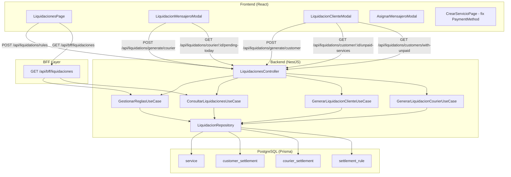

# Design Document — Liquidaciones

## Overview

El módulo de Liquidaciones gestiona dos flujos financieros distintos dentro de TracKing:

1. **Liquidación de Mensajeros**: calcula el pago a cada mensajero por los servicios entregados en el día actual, aplicando la regla de comisión activa de la empresa (porcentaje o monto fijo sobre `delivery_price`). Solo incluye servicios con `is_settled_courier = false` y `status = DELIVERED`.

2. **Liquidación de Clientes**: permite cobrar a los clientes los servicios con `payment_status = UNPAID`. Los servicios se seleccionan individualmente con soporte de filtro por rango de fechas.

El módulo backend ya existe parcialmente (`src/modules/liquidaciones/`). Este diseño cubre las extensiones necesarias para soportar los nuevos endpoints requeridos por el frontend, el BFF de liquidaciones, la corrección del campo `is_settled_customer` → `payment_status`, y los componentes frontend.

**Decisiones de diseño clave:**
- El filtrado de servicios de cliente usa `payment_status = UNPAID` como criterio principal, eliminando la dependencia de `is_settled_customer`.
- Las liquidaciones de mensajero operan siempre sobre el día actual (`delivery_date` del día en curso), sin selector de fecha en el frontend.
- El BFF `/api/bff/liquidaciones` agrega mensajeros, regla activa y conteo de pendientes en una sola llamada.
- La generación de comprobante es client-side (print/PDF del navegador), sin endpoint adicional.

---

## Architecture



**Nuevos endpoints backend:**

| Método | Ruta | Roles | Descripción |
|--------|------|-------|-------------|
| GET | `/api/bff/liquidaciones` | ADMIN, AUX | BFF: mensajeros + regla activa + pendientes hoy |
| GET | `/api/liquidations/courier/:courier_id/pending-today` | ADMIN, AUX | Servicios pendientes del día para un mensajero |
| GET | `/api/liquidations/customers/with-unpaid` | ADMIN, AUX | Clientes con al menos un servicio UNPAID |
| GET | `/api/liquidations/customer/:customer_id/unpaid-services` | ADMIN, AUX | Servicios UNPAID de un cliente (filtro from/to) |

**Endpoints existentes que se mantienen sin cambios:**

| Método | Ruta | Descripción |
|--------|------|-------------|
| POST | `/api/liquidations/generate/courier` | Generar liquidación mensajero |
| POST | `/api/liquidations/generate/customer` | Generar liquidación cliente (actualizado: usa `payment_status`) |
| POST | `/api/liquidations/rules` | Crear/actualizar regla activa |
| GET | `/api/liquidations/rules/active` | Regla activa |

---

## Components and Interfaces

### Backend — Nuevos métodos en `LiquidacionRepository`

```typescript
// Servicios pendientes del día actual para un mensajero
async findPendingTodayCourier(company_id: string, courier_id: string): Promise<PendingServiceRow[]>
// WHERE: status = DELIVERED, is_settled_courier = false,
//        delivery_date >= hoy 00:00, delivery_date <= hoy 23:59

// Clientes con al menos un servicio UNPAID
async findCustomersWithUnpaid(company_id: string): Promise<CustomerWithUnpaidCount[]>
// GROUP BY customer_id, COUNT servicios con payment_status = UNPAID

// Servicios UNPAID de un cliente con filtro de fechas opcional
async findUnpaidServicesByCustomer(
  company_id: string,
  customer_id: string,
  from?: Date,
  to?: Date
): Promise<UnpaidServiceRow[]>
// WHERE: payment_status = UNPAID, delivery_date entre from y to si se proveen

// Marcar servicios como PAID (reemplaza markCustomerServicesAsSettled)
async markServicesAsPaid(service_ids: string[], company_id: string): Promise<void>
// UPDATE service SET payment_status = 'PAID' WHERE id IN (...)
```

### Backend — Nuevo use-case `BffLiquidacionesUseCase`

```typescript
// src/modules/bff-web/application/use-cases/bff-liquidaciones.use-case.ts
@Injectable()
export class BffLiquidacionesUseCase {
  constructor(
    private readonly consultarMensajeros: ConsultarMensajerosUseCase,
    private readonly gestionarReglas: GestionarReglasUseCase,
    private readonly liquidacionRepo: LiquidacionRepository,
  ) {}

  async execute(company_id: string): Promise<BffLiquidacionesResponse> {
    const [mensajeros, reglaActiva, pendientesHoy] = await Promise.all([
      this.consultarMensajeros.findAll(company_id),   // AVAILABLE + UNAVAILABLE
      this.gestionarReglas.findActive(company_id),
      this.liquidacionRepo.countCouriersWithPendingToday(company_id),
    ]);
    return { mensajeros, regla_activa: reglaActiva, pendientes_hoy: pendientesHoy };
  }
}
```

### Backend — Nuevos endpoints en `LiquidacionesController`

```typescript
// GET /api/liquidations/courier/:courier_id/pending-today
@Get('courier/:courier_id/pending-today')
@Roles(Role.ADMIN, Role.AUX)
async pendingToday(@Param('courier_id') courier_id: string, @CurrentUser() user: JwtPayload)

// GET /api/liquidations/customers/with-unpaid
@Get('customers/with-unpaid')
@Roles(Role.ADMIN, Role.AUX)
async customersWithUnpaid(@CurrentUser() user: JwtPayload)

// GET /api/liquidations/customer/:customer_id/unpaid-services
@Get('customer/:customer_id/unpaid-services')
@Roles(Role.ADMIN, Role.AUX)
async unpaidServices(
  @Param('customer_id') customer_id: string,
  @Query('from') from: string | undefined,
  @Query('to') to: string | undefined,
  @CurrentUser() user: JwtPayload
)
```

### Frontend — Estructura de archivos

```
src/features/liquidaciones/
├── api/liquidacionesApi.ts          # Llamadas HTTP
├── components/
│   ├── LiquidacionMensajeroModal.tsx
│   ├── LiquidacionClienteModal.tsx
│   ├── ReglaLiquidacionCard.tsx     # Card editable de comisión
│   └── LiquidacionPreview.tsx       # Panel de cálculo (mensajero)
├── hooks/
│   ├── useLiquidacionesPage.ts      # Datos BFF + regla
│   ├── usePendingTodayCourier.ts    # Servicios pendientes del día
│   ├── useCustomersWithUnpaid.ts    # Clientes con deuda
│   ├── useUnpaidServices.ts         # Servicios UNPAID de un cliente
│   ├── useGenerarLiquidacionCourier.ts
│   └── useGenerarLiquidacionCliente.ts
├── pages/
│   └── LiquidacionesPage.tsx        # Página única con dos modales
├── types/liquidacion.types.ts
└── index.ts

src/features/servicios/components/
└── AsignarMensajeroModal.tsx        # Componente reutilizable (nuevo)
```

### Frontend — Tipos principales

```typescript
// liquidacion.types.ts

export interface ReglaActiva {
  id: string
  type: 'PERCENTAGE' | 'FIXED'
  value: number
  active: boolean
  created_at: string
}

export interface MensajeroConPendientes {
  id: string
  user: { name: string }
  operational_status: 'AVAILABLE' | 'UNAVAILABLE' | 'IN_SERVICE'
}

export interface ServicioPendienteMensajero {
  id: string
  customer: { name: string }
  delivery_date: string
  payment_method: 'CASH' | 'TRANSFER' | 'CREDIT'
  delivery_price: number
}

export interface ClienteConUnpaid {
  id: string
  name: string
  unpaid_count: number
}

export interface ServicioUnpaidCliente {
  id: string
  delivery_date: string
  payment_method: 'CASH' | 'TRANSFER' | 'CREDIT'
  delivery_price: number
}

export interface BffLiquidacionesResponse {
  mensajeros: MensajeroConPendientes[]
  regla_activa: ReglaActiva | null
  pendientes_hoy: number
}

export interface LiquidacionCourierResult {
  id: string
  courier_id: string
  total_services: number
  total_earned: number
  start_date: string
  end_date: string
  generation_date: string
}

export interface LiquidacionClienteResult {
  id: string
  customer_id: string
  total_services: number
  total_invoiced: number
  start_date: string
  end_date: string
  generation_date: string
}
```

---

## Data Models

### Schema Prisma — cambios requeridos

**Eliminar `is_settled_customer` del modelo `Service`:**

```prisma
// ANTES
model Service {
  is_settled_courier  Boolean @default(false)
  is_settled_customer Boolean @default(false)  // ← ELIMINAR
  payment_status      PaymentStatus @default(UNPAID)
  ...
}

// DESPUÉS
model Service {
  is_settled_courier Boolean @default(false)
  payment_status     PaymentStatus @default(UNPAID)  // criterio principal para cliente
  ...
}
```

El campo `payment_status` ya existe en el schema y es el criterio correcto para identificar servicios pendientes de cobro al cliente. `is_settled_customer` es redundante.

**Migración requerida:**
```sql
ALTER TABLE service DROP COLUMN is_settled_customer;
```

### Flujo de datos — Liquidación Mensajero

```
delivery_date (hoy 00:00–23:59)
  + status = DELIVERED
  + is_settled_courier = false
  + courier_id = <seleccionado>
  ↓
[servicios pendientes del día]
  ↓
calcularTotalLiquidacion(servicios, reglaActiva)
  ↓
createCourierSettlement { total_services, total_earned }
  ↓
markCourierServicesAsSettled(service_ids)  → is_settled_courier = true
```

### Flujo de datos — Liquidación Cliente

```
payment_status = UNPAID
  + customer_id = <seleccionado>
  + delivery_date entre [from, to] (opcional)
  ↓
[servicios UNPAID del cliente]
  ↓
admin selecciona service_ids individualmente
  ↓
POST /api/liquidations/generate/customer { service_ids[] }
  ↓
createCustomerSettlement { total_services, total_invoiced }
  ↓
markServicesAsPaid(service_ids)  → payment_status = PAID
```

### Cálculo de comisión

```
PERCENTAGE: total_earned = Σ(delivery_price_i * value / 100)
FIXED:      total_earned = Σ(value)  = value * total_services

total_a_pagar = Σ(delivery_price_i) - total_earned
```

### Serialización de Decimales

Todos los campos `Decimal` de Prisma (`delivery_price`, `total_earned`, `total_invoiced`) se convierten a `number` de JavaScript antes de retornar al frontend usando `Number(prismaDecimal)`. Esto garantiza que el frontend recibe `number`, no `string` ni objeto `Decimal`.

---

## Correctness Properties


*A property is a characteristic or behavior that should hold true across all valid executions of a system — essentially, a formal statement about what the system should do. Properties serve as the bridge between human-readable specifications and machine-verifiable correctness guarantees.*

### Property 1: Forma del resultado del BFF de liquidaciones

*For any* `company_id` válido, cuando `BffLiquidacionesUseCase.execute` completa sin error, el objeto retornado debe contener exactamente las claves `mensajeros` (array), `regla_activa` (objeto o null) y `pendientes_hoy` (número entero ≥ 0).

**Validates: Requirements 10.1, 10.3**

---

### Property 2: Filtrado de mensajeros por estado en el modal

*For any* empresa con mensajeros en distintos estados operacionales, el endpoint `GET /api/liquidations/courier/:id/pending-today` y la lista del modal deben incluir únicamente mensajeros con `operational_status` igual a `AVAILABLE` o `UNAVAILABLE`, y mostrar como deshabilitados (no seleccionables) a los que tienen `operational_status = IN_SERVICE`.

**Validates: Requirements 2.1, 2.3**

---

### Property 3: Filtrado de servicios pendientes por día actual

*For any* mensajero y empresa, los servicios retornados por `GET /api/liquidations/courier/:courier_id/pending-today` deben tener `status = DELIVERED`, `is_settled_courier = false`, y `delivery_date` dentro del rango `[hoy 00:00:00, hoy 23:59:59]` en la zona horaria del servidor. Ningún servicio de días anteriores o posteriores debe aparecer en el resultado.

**Validates: Requirements 3.3, 5.1, 5.2**

---

### Property 4: Cálculo correcto con regla PERCENTAGE

*For any* conjunto de servicios y porcentaje de comisión `p` (0 < p ≤ 100), el `total_earned` calculado debe ser igual a `Σ(delivery_price_i * p / 100)` con precisión de al menos 5 decimales. (Esta propiedad ya está cubierta por el test P-7.8 en `specs/liquidaciones.spec.ts`.)

**Validates: Requirements 4.1**

---

### Property 5: Cálculo correcto con regla FIXED

*For any* conjunto de servicios y valor fijo `v`, el `total_earned` calculado debe ser igual a `v * cantidad_servicios`, independientemente del `delivery_price` de cada servicio. (Esta propiedad ya está cubierta por el test P-7.9 en `specs/liquidaciones.spec.ts`.)

**Validates: Requirements 4.2**

---

### Property 6: Marcado de servicios como liquidados (mensajero)

*For any* conjunto de servicios incluidos en una liquidación de mensajero generada exitosamente, todos esos servicios deben tener `is_settled_courier = true` inmediatamente después de la generación. Ningún servicio fuera del conjunto debe ser modificado.

**Validates: Requirements 4.4**

---

### Property 7: Filtrado de clientes con servicios UNPAID

*For any* empresa, el endpoint `GET /api/liquidations/customers/with-unpaid` debe retornar únicamente clientes que tengan al menos un servicio con `payment_status = UNPAID`. Ningún cliente sin servicios UNPAID debe aparecer en el resultado.

**Validates: Requirements 7.1, 9.1**

---

### Property 8: Filtrado de servicios por rango de fechas (cliente)

*For any* cliente, empresa y par de fechas `(from, to)` donde `from ≤ to`, los servicios retornados por `GET /api/liquidations/customer/:id/unpaid-services?from=...&to=...` deben tener `payment_status = UNPAID` y `delivery_date` dentro del rango `[from, to]`. Ningún servicio fuera del rango debe aparecer.

**Validates: Requirements 7.4, 10.6**

---

### Property 9: Cálculo del total de liquidación de cliente en tiempo real

*For any* selección de servicios en el `LiquidacionClienteModal`, el total mostrado debe ser exactamente igual a `Σ(delivery_price_i)` de los servicios seleccionados. Al agregar o quitar un servicio de la selección, el total debe actualizarse inmediatamente reflejando el nuevo conjunto.

**Validates: Requirements 8.3**

---

### Property 10: Marcado de servicios como PAID tras liquidación de cliente

*For any* conjunto de `service_ids` incluidos en una liquidación de cliente generada exitosamente, todos esos servicios deben tener `payment_status = PAID` inmediatamente después de la generación. Ningún servicio fuera del conjunto debe ser modificado.

**Validates: Requirements 8.5, 9.2**

---

### Property 11: Mapeo correcto del enum PaymentMethod

*For any* valor del enum `PaymentMethod` (`CASH`, `TRANSFER`, `CREDIT`), el formulario de creación de servicios debe enviar exactamente ese valor string al endpoint `POST /api/services`. El mapeo entre valor del enum y etiqueta en español debe ser biyectivo: cada valor tiene exactamente una etiqueta y cada etiqueta corresponde a exactamente un valor.

**Validates: Requirements 11.1, 11.2, 11.3, 11.4**

---

### Property 12: Filtrado del AsignarMensajeroModal solo AVAILABLE

*For any* empresa, el `AsignarMensajeroModal` debe mostrar únicamente mensajeros con `operational_status = AVAILABLE`. Ningún mensajero con estado `UNAVAILABLE` o `IN_SERVICE` debe aparecer en la lista de selección.

**Validates: Requirements 12.1**

---

### Property 13: Round-trip de serialización de valores Decimal

*For any* valor `Decimal` de Prisma en los campos `delivery_price`, `total_earned` o `total_invoiced`, la secuencia `Number(prismaDecimal)` → serializar a JSON → parsear de JSON debe producir un valor numérico de JavaScript equivalente al original con precisión de dos decimales. El tipo retornado debe ser `number`, no `string` ni objeto `Decimal`.

**Validates: Requirements 14.1, 14.2, 14.3, 14.4**

---

## Error Handling

### Backend

**Validaciones en use-cases existentes (sin cambios):**
- `validarReglaActiva(null)` → `AppException` 400: "No existe una regla de liquidación activa para esta empresa"
- `validarRangoFechas(start, end)` → `AppException` 400: "start_date debe ser anterior a end_date"
- `validarResultadoLiquidacion(0, 0)` → `AppException` 400: "No hay servicios DELIVERED en el rango de fechas indicado"
- Mensajero/cliente no encontrado → `NotFoundException` 404

**Nuevos endpoints — manejo de errores:**

```typescript
// GET /api/liquidations/courier/:courier_id/pending-today
// Si courier_id no es UUID válido → 400 (class-validator @IsUUID en param)
// Si mensajero no pertenece a la empresa → 404

// GET /api/liquidations/customers/with-unpaid
// Sin errores esperados — retorna array vacío si no hay clientes con UNPAID

// GET /api/liquidations/customer/:customer_id/unpaid-services
// Si from > to → AppException 400: "from debe ser anterior o igual a to"
// Si customer_id no pertenece a la empresa → 404

// POST /api/liquidations/generate/customer (actualizado)
// Si service_ids está vacío → AppException 400
// Si algún service_id no pertenece a la empresa → AppException 400
// Si algún servicio ya tiene payment_status = PAID → AppException 400
```

**BFF `/api/bff/liquidaciones`:**
- Si cualquier consulta interna falla, el error se propaga sin suprimirlo (mismo patrón que otros BFF).

### Frontend

- Todos los errores de queries se manejan con el patrón TanStack Query (`isError` + toast de error).
- Si `regla_activa` es `null`, el botón "Cerrar Liquidación" del mensajero se deshabilita y se muestra mensaje de configuración requerida.
- Si `pendientes_hoy > 0` al cargar la página, se muestra el indicador de alerta.
- Errores de red en mutaciones (`generateCourier`, `generateCliente`, `updateRule`) se muestran con toast de error.

---

## Testing Strategy

### Dual Testing Approach

Se usan dos tipos de tests complementarios:

**Unit tests** — para ejemplos concretos, casos de integración y edge cases:
- Verificar que `LiquidacionesPage` renderiza los dos botones de flujo
- Verificar que el modal de mensajero no muestra mensajeros IN_SERVICE como seleccionables
- Verificar que el estado vacío aparece cuando no hay servicios pendientes
- Verificar que el botón "Cerrar Liquidación" se deshabilita sin servicios seleccionados
- Verificar que `POST /api/liquidations/generate/customer` recibe los `service_ids` correctos
- Verificar que el formulario de creación de servicios envía los valores correctos del enum

**Property-based tests** — para propiedades universales (Properties 1–13 del documento):
- Generan inputs aleatorios y verifican que las propiedades se cumplen para todos ellos
- Mínimo 100 iteraciones por propiedad

### Librería PBT

**Backend (NestJS/TypeScript):** [`fast-check`](https://github.com/dubzzz/fast-check) (ya instalado en el proyecto)

**Frontend (React/Vitest):** [`fast-check`](https://github.com/dubzzz/fast-check) con `@testing-library/react`

### Tests del backend

Los tests se ubican en `TracKing-backend/specs/liquidaciones.spec.ts` (ya existe, se extiende):

```typescript
// Property 1: Forma del BFF
// Feature: liquidaciones, Property 1: BFF result shape
it('BffLiquidacionesUseCase retorna mensajeros, regla_activa y pendientes_hoy para cualquier company_id', async () => {
  await fc.assert(
    fc.asyncProperty(fc.uuid(), async (companyId) => {
      const result = await bffUseCase.execute(companyId)
      expect(result).toHaveProperty('mensajeros')
      expect(result).toHaveProperty('regla_activa')
      expect(result).toHaveProperty('pendientes_hoy')
      expect(typeof result.pendientes_hoy).toBe('number')
      expect(result.pendientes_hoy).toBeGreaterThanOrEqual(0)
    }),
    { numRuns: 100 }
  )
})

// Property 3: Filtrado por día actual
// Feature: liquidaciones, Property 3: pending-today filters by current day
it('findPendingTodayCourier retorna solo servicios del día actual con is_settled_courier = false', async () => {
  await fc.assert(
    fc.asyncProperty(fc.uuid(), fc.uuid(), async (companyId, courierId) => {
      const services = await repo.findPendingTodayCourier(companyId, courierId)
      const today = new Date()
      services.forEach(s => {
        expect(s.is_settled_courier).toBe(false)
        expect(s.status).toBe('DELIVERED')
        const d = new Date(s.delivery_date)
        expect(d.toDateString()).toBe(today.toDateString())
      })
    }),
    { numRuns: 100 }
  )
})

// Property 13: Round-trip de Decimal
// Feature: liquidaciones, Property 13: Decimal serialization round-trip
it('Number(prismaDecimal) serializado a JSON y parseado produce el mismo número', () => {
  fc.assert(
    fc.property(
      fc.float({ min: 0, max: 999999.99, noNaN: true }),
      (value) => {
        const asNumber = Number(value.toFixed(2))
        const serialized = JSON.stringify({ v: asNumber })
        const parsed = JSON.parse(serialized)
        expect(typeof parsed.v).toBe('number')
        expect(parsed.v).toBeCloseTo(asNumber, 2)
      }
    ),
    { numRuns: 100 }
  )
})
```

### Tests del frontend

```typescript
// src/features/liquidaciones/pages/LiquidacionesPage.test.tsx

// Property 9: Cálculo del total en tiempo real
// Feature: liquidaciones, Property 9: client total updates in real time
it('el total se actualiza correctamente al seleccionar/deseleccionar servicios', () => {
  fc.assert(
    fc.property(
      fc.array(fc.float({ min: 1, max: 10000, noNaN: true }), { minLength: 1, maxLength: 20 }),
      (prices) => {
        const services = prices.map((p, i) => ({ id: `s-${i}`, delivery_price: p }))
        const selectedIds = services.slice(0, Math.ceil(services.length / 2)).map(s => s.id)
        const expectedTotal = services
          .filter(s => selectedIds.includes(s.id))
          .reduce((sum, s) => sum + s.delivery_price, 0)
        // render + select + verify total
        expect(calculateTotal(services, selectedIds)).toBeCloseTo(expectedTotal, 2)
      }
    ),
    { numRuns: 100 }
  )
})

// Property 11: Mapeo de PaymentMethod
// Feature: liquidaciones, Property 11: PaymentMethod enum mapping
it('cada valor del enum PaymentMethod mapea a exactamente una etiqueta en español', () => {
  fc.assert(
    fc.property(
      fc.constantFrom('CASH', 'TRANSFER', 'CREDIT'),
      (method) => {
        const label = getPaymentMethodLabel(method)
        expect(['Efectivo', 'Transferencia', 'Crédito']).toContain(label)
        // biyectividad: el label mapea de vuelta al mismo método
        expect(getPaymentMethodFromLabel(label)).toBe(method)
      }
    ),
    { numRuns: 100 }
  )
})
```

### Configuración de property tests

Cada test de propiedad debe:
- Ejecutar mínimo **100 iteraciones** (`numRuns: 100`)
- Incluir un comentario con el tag: `// Feature: liquidaciones, Property N: <texto>`
- Referenciar la propiedad del documento de diseño que implementa

### Balance unit/property tests

- **Unit tests:** renderizado de componentes, interacciones UI, casos de error específicos, integración entre capas
- **Property tests:** cálculos matemáticos, filtrados de datos, serialización, forma de respuestas BFF
- Las Properties 4 y 5 ya están implementadas en `specs/liquidaciones.spec.ts` (P-7.8 y P-7.9) — no duplicar
