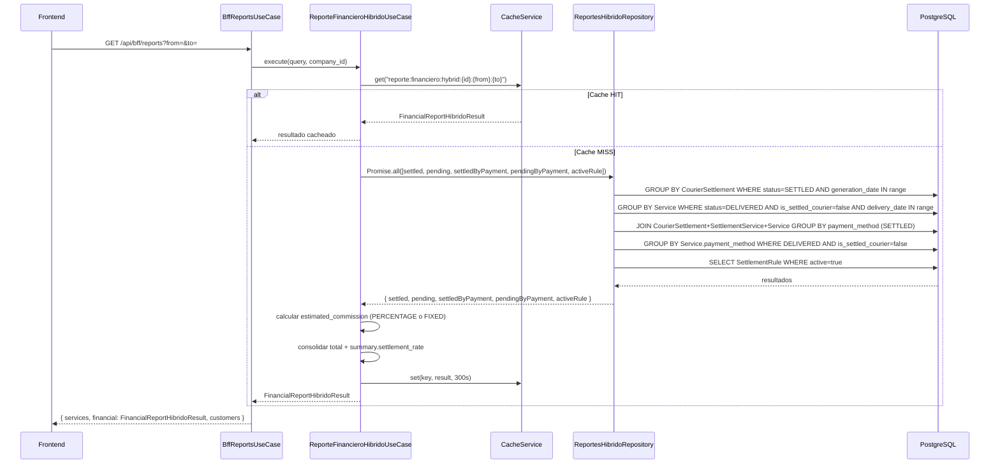

# Diseño: Reportes Financieros Híbridos

## Visión General

El reporte financiero actual de TracKing consulta únicamente la tabla `Service` y recalcula todo en tiempo real. Esto genera tres problemas concretos:

1. **Performance**: queries pesadas sobre `Service` sin pre-agregación.
2. **Inconsistencia de fechas**: mezcla `delivery_date` con `generation_date` de liquidaciones.
3. **Falta de trazabilidad**: no distingue entre ingresos ya auditados (liquidaciones cerradas) e ingresos estimados (servicios pendientes).

El diseño híbrido resuelve esto combinando dos ramas de datos:

- **Rama liquidaciones** (`CourierSettlement` con `status = 'SETTLED'`): datos pre-agregados, auditables, inmutables.
- **Rama pendientes** (`Service` con `status = 'DELIVERED'` e `is_settled_courier = false`): datos en tiempo real con comisión estimada.

Ambas ramas se consolidan en memoria en el use case, se cachean 300 s, y se exponen a través de un nuevo endpoint `GET /api/reports/financial/hybrid` y del BFF existente `GET /api/bff/reports`.

---

## Arquitectura

### Diagrama de capas

```
Frontend (React)
  └── ReportsPage.tsx
        ├── SettledSection.tsx        (NUEVO)
        ├── PendingSection.tsx        (NUEVO)
        └── ConsolidatedSection.tsx   (NUEVO)

BFF Web (NestJS)
  └── BffWebController  GET /api/bff/reports
        └── BffReportsUseCase         (ACTUALIZAR)
              └── ReporteFinancieroHibridoUseCase  (NUEVO)

Reportes (NestJS)
  └── ReportesController  GET /api/reports/financial/hybrid  (NUEVO endpoint)
        └── ReporteFinancieroHibridoUseCase  (NUEVO)
              └── ReportesHibridoRepository  (NUEVO)
                    ├── Rama A: CourierSettlement (SETTLED)
                    └── Rama B: Service (DELIVERED + is_settled_courier=false)
```

### Diagrama de secuencia — flujo completo



---

## Componentes e Interfaces

### Backend — archivos nuevos

#### `src/modules/reportes/application/dto/reporte-financiero-hibrido.dto.ts`

```typescript
import { IsDateString, IsOptional } from 'class-validator';
import { ApiPropertyOptional } from '@nestjs/swagger';

export class ReporteFinancieroHibridoQueryDto {
  @ApiPropertyOptional({ example: '2025-01-01' })
  @IsOptional()
  @IsDateString()
  from?: string;

  @ApiPropertyOptional({ example: '2025-01-31' })
  @IsOptional()
  @IsDateString()
  to?: string;
}
```

#### `src/modules/reportes/infrastructure/reportes-hibrido.repository.ts`

Métodos públicos:

```typescript
interface SettledBranchResult {
  count: number;
  total_services: number;
  total_collected: number;
  company_commission: number;
  courier_payment: number;
}

interface PendingBranchResult {
  count: number;
  total_collected: number;
}

interface PaymentMethodBreakdownRow {
  method: string;
  total: number;
  count: number;
}

class ReportesHibridoRepository {
  /** Agrega liquidaciones SETTLED en el rango por generation_date */
  async getSettledBranch(company_id: string, from: Date, to: Date): Promise<SettledBranchResult>

  /** Agrega servicios DELIVERED + is_settled_courier=false en el rango por delivery_date */
  async getPendingBranch(company_id: string, from: Date, to: Date): Promise<PendingBranchResult>

  /** JOIN CourierSettlement → SettlementService → Service, GROUP BY payment_method (solo SETTLED) */
  async getSettledByPaymentMethod(company_id: string, from: Date, to: Date): Promise<PaymentMethodBreakdownRow[]>

  /** GROUP BY payment_method en Service DELIVERED + is_settled_courier=false */
  async getPendingByPaymentMethod(company_id: string, from: Date, to: Date): Promise<PaymentMethodBreakdownRow[]>

  /** Retorna la SettlementRule activa o null */
  async getActiveRule(company_id: string): Promise<{ type: 'PERCENTAGE' | 'FIXED'; value: number } | null>
}
```

#### `src/modules/reportes/application/use-cases/reporte-financiero-hibrido.use-case.ts`

```typescript
export interface FinancialReportHibridoResult {
  period: { from: string; to: string };
  settled: {
    count: number;
    total_services: number;
    total_collected: number;
    company_commission: number;
    courier_payment: number;
    by_payment_method: { method: string; total: number; count: number }[];
  };
  pending: {
    count: number;
    total_collected: number;
    estimated_commission: number;
    estimated_courier_payment: number;
    by_payment_method: { method: string; total: number; count: number }[];
  };
  total: {
    total_services: number;
    total_collected: number;
    company_commission: number;
    courier_payment: number;
  };
  summary: {
    settlement_rate: number;   // porcentaje redondeado a 1 decimal
    pending_amount: number;    // total_collected - settled.total_collected
  };
}
```

### Backend — archivos a modificar

#### `reportes.module.ts` — agregar providers y exports

```typescript
// Agregar:
import { ReportesHibridoRepository } from './infrastructure/reportes-hibrido.repository';
import { ReporteFinancieroHibridoUseCase } from './application/use-cases/reporte-financiero-hibrido.use-case';

providers: [
  ReporteServiciosUseCase,
  ReporteFinancieroUseCase,
  ReporteFavoritosUseCase,
  ReporteFinancieroHibridoUseCase,   // NUEVO
  ReportesRepository,
  ReportesHibridoRepository,          // NUEVO
],
exports: [
  ReporteServiciosUseCase,
  ReporteFinancieroUseCase,
  ReporteFavoritosUseCase,
  ReporteFinancieroHibridoUseCase,   // NUEVO
],
```

#### `reportes.controller.ts` — nuevo endpoint

```typescript
@Get('financial/hybrid')
@Roles(Role.ADMIN)
@ApiOperation({ summary: 'Reporte financiero híbrido (liquidaciones + pendientes)' })
@ApiQuery({ name: 'from', required: true, example: '2025-01-01' })
@ApiQuery({ name: 'to', required: true, example: '2025-01-31' })
@ApiResponse({ status: 200, description: 'Reporte híbrido con secciones settled, pending, total y summary' })
@ApiResponse({ status: 400, description: 'Rango de fechas inválido o faltante' })
async financialHybrid(
  @Query() query: ReporteFinancieroHibridoQueryDto,
  @CurrentUser() user: JwtPayload,
) {
  return ok(await this.financieroHibridoReport.execute(query, user.company_id!));
}
```

El endpoint `GET /api/reports/financial` existente **no se modifica**.

#### `bff-reports.use-case.ts` — reemplazar use case financiero

```typescript
// Antes:
private readonly reporteFinanciero: ReporteFinancieroUseCase,

// Después:
private readonly reporteFinanciero: ReporteFinancieroHibridoUseCase,
```

El campo `financial` en la respuesta del BFF pasa de `FinancieroReportResult` a `FinancialReportHibridoResult`.

### Frontend — tipos nuevos en `src/types/bff.ts`

```typescript
export interface PaymentMethodBreakdown {
  method: string
  total: number
  count: number
}

export interface SettledReportData {
  count: number
  total_services: number
  total_collected: number
  company_commission: number
  courier_payment: number
  by_payment_method: PaymentMethodBreakdown[]
}

export interface PendingReportData {
  count: number
  total_collected: number
  estimated_commission: number
  estimated_courier_payment: number
  by_payment_method: PaymentMethodBreakdown[]
}

export interface TotalReportData {
  total_services: number
  total_collected: number
  company_commission: number
  courier_payment: number
}

export interface SummaryData {
  settlement_rate: number   // 0–100, 1 decimal
  pending_amount: number
}

export interface BffFinancialReportHybrid {
  period: BffPeriod
  settled: SettledReportData
  pending: PendingReportData
  total: TotalReportData
  summary: SummaryData
}

// BffReportsResponse.financial cambia de BffFinancialReport a BffFinancialReportHybrid
export interface BffReportsResponse {
  services: BffServicesReport
  financial: BffFinancialReportHybrid   // ← actualizado
  customers: BffFavoriteCustomerReport[]
}
```

`BffFinancialReport` se mantiene en el archivo para no romper otros consumidores (dashboard).

### Frontend — componentes nuevos

#### `SettledSection.tsx`

Props: `{ data: SettledReportData }`

Muestra: count de liquidaciones, total_services, total_collected, company_commission, courier_payment, tabla de by_payment_method. Estilo: verde esmeralda (datos auditados).

#### `PendingSection.tsx`

Props: `{ data: PendingReportData }`

Muestra: count de servicios, total_collected, estimated_commission, estimated_courier_payment, tabla de by_payment_method. Estilo: ámbar (datos estimados, indicador visual de pendiente).

#### `ConsolidatedSection.tsx`

Props: `{ total: TotalReportData; summary: SummaryData }`

Muestra: total_services, total_collected, company_commission, courier_payment, settlement_rate como barra de progreso o porcentaje, pending_amount cuando settlement_rate < 100.

### Frontend — cambios en `ReportsPage.tsx`

1. Reemplazar `import type { BffFinancialReport }` por `BffFinancialReportHybrid`.
2. Reemplazar `FinancialModalContent` por composición de los tres nuevos componentes.
3. Actualizar el preview de la tarjeta financiera:

```tsx
preview: financialReport
  ? `${fmt(financialReport.total.total_collected)} · ${financialReport.total.total_services} servicios · ${financialReport.summary.settlement_rate}% liquidado`
  : null,
```

---

## Modelos de Datos

### Queries del repositorio híbrido

#### Rama A — liquidaciones completadas

```typescript
// getSettledBranch
const result = await prisma.courierSettlement.aggregate({
  where: {
    company_id,
    status: 'SETTLED',
    generation_date: { gte: from, lte: to },
  },
  _sum: {
    total_services: true,
    total_collected: true,
    company_commission: true,
    courier_payment: true,
  },
  _count: { id: true },
});
```

Índice utilizado: `@@index([company_id, generation_date(sort: Desc)])` en `CourierSettlement` ✅

#### Rama B — servicios pendientes

```typescript
// getPendingBranch
const result = await prisma.service.aggregate({
  where: {
    company_id,
    status: 'DELIVERED',
    is_settled_courier: false,
    delivery_date: { gte: from, lte: to },
  },
  _sum: { delivery_price: true },
  _count: { id: true },
});
```

Índices utilizados:
- `@@index([company_id, status, delivery_date])` ✅
- `@@index([company_id, is_settled_courier])` ✅

**Decisión sobre índice compuesto faltante**: El schema no tiene `@@index([company_id, status, is_settled_courier, delivery_date])`. PostgreSQL puede combinar los índices existentes con un bitmap index scan, pero para la query de pendientes (que filtra por los cuatro campos simultáneamente) el planner podría preferir un índice compuesto. Se recomienda agregar este índice si el volumen de `Service` supera ~100k filas por empresa. Para el MVP, los índices existentes son suficientes y no se requiere migración adicional. Ver Requisito 12.4.

#### Rama A por método de pago (JOIN)

```typescript
// getSettledByPaymentMethod — raw query via prisma.$queryRaw
SELECT s.payment_method, SUM(s.delivery_price) as total, COUNT(s.id) as count
FROM courier_settlement cs
JOIN settlement_service ss ON ss.settlement_id = cs.id
JOIN service s ON s.id = ss.service_id
WHERE cs.company_id = $1
  AND cs.status = 'SETTLED'
  AND cs.generation_date >= $2
  AND cs.generation_date <= $3
GROUP BY s.payment_method
```

#### Rama B por método de pago

```typescript
// getPendingByPaymentMethod
await prisma.service.groupBy({
  by: ['payment_method'],
  where: {
    company_id,
    status: 'DELIVERED',
    is_settled_courier: false,
    delivery_date: { gte: from, lte: to },
  },
  _sum: { delivery_price: true },
  _count: { id: true },
});
```

### Lógica de estimación de comisión

```typescript
function calculateEstimatedCommission(
  totalPendingCollected: number,
  pendingCount: number,
  rule: { type: 'PERCENTAGE' | 'FIXED'; value: number } | null,
): { estimated_commission: number; estimated_courier_payment: number } {
  if (!rule) {
    return { estimated_commission: 0, estimated_courier_payment: totalPendingCollected };
  }
  const commission =
    rule.type === 'PERCENTAGE'
      ? totalPendingCollected * (rule.value / 100)
      : pendingCount * rule.value;
  return {
    estimated_commission: commission,
    estimated_courier_payment: totalPendingCollected - commission,
  };
}
```

### Lógica de consolidación

```typescript
function consolidate(settled, pending): { total, summary } {
  const total = {
    total_services: settled.total_services + pending.count,
    total_collected: settled.total_collected + pending.total_collected,
    company_commission: settled.company_commission + pending.estimated_commission,
    courier_payment: settled.courier_payment + pending.estimated_courier_payment,
  };
  const settlement_rate =
    total.total_collected > 0
      ? Math.round((settled.total_collected / total.total_collected) * 1000) / 10
      : 0;
  const summary = {
    settlement_rate,
    pending_amount: total.total_collected - settled.total_collected,
  };
  return { total, summary };
}
```

---

## Propiedades de Corrección

*Una propiedad es una característica o comportamiento que debe ser verdadero en todas las ejecuciones válidas del sistema — esencialmente, una declaración formal sobre lo que el software debe hacer. Las propiedades sirven como puente entre especificaciones legibles por humanos y garantías de corrección verificables automáticamente.*

### Propiedad 1: Agregación de liquidaciones es consistente con los datos de entrada

*Para cualquier* lista de registros `CourierSettlement` con `status = 'SETTLED'`, la función de agregación SHALL retornar `count`, `total_services`, `total_collected`, `company_commission` y `courier_payment` iguales a la suma manual de cada campo sobre todos los registros de la lista.

**Valida: Requisitos 1.2, 1.3**

### Propiedad 2: Agregación de pendientes es consistente con los datos de entrada

*Para cualquier* lista de registros `Service` con `status = 'DELIVERED'` e `is_settled_courier = false`, la función de agregación SHALL retornar `count` y `total_collected` iguales al conteo y suma manual de `delivery_price` sobre todos los registros.

**Valida: Requisitos 2.2, 2.4**

### Propiedad 3: GroupBy por método de pago es partición completa

*Para cualquier* lista de servicios con métodos de pago arbitrarios, el resultado de agrupar por `payment_method` SHALL satisfacer que la suma de todos los `total` de los grupos sea igual a la suma de `delivery_price` de todos los servicios, y la suma de todos los `count` sea igual al total de servicios.

**Valida: Requisitos 2.3**

### Propiedad 4: Cálculo de comisión PERCENTAGE es correcto

*Para cualquier* `total_pending_collected ≥ 0` y `rule.value` en `[0, 100]`, cuando la regla activa es de tipo `PERCENTAGE`, `estimated_commission` SHALL ser igual a `total_pending_collected * (rule.value / 100)` y `estimated_courier_payment` SHALL ser igual a `total_pending_collected - estimated_commission`.

**Valida: Requisitos 3.2, 3.5**

### Propiedad 5: Cálculo de comisión FIXED es correcto

*Para cualquier* `pending_count ≥ 0` y `rule.value ≥ 0`, cuando la regla activa es de tipo `FIXED`, `estimated_commission` SHALL ser igual a `pending_count * rule.value` y `estimated_courier_payment` SHALL ser igual a `total_pending_collected - estimated_commission`.

**Valida: Requisitos 3.3, 3.5**

### Propiedad 6: Consolidación total es suma de partes

*Para cualquier* par de ramas `settled` y `pending` con valores numéricos no negativos, el objeto `total` SHALL satisfacer:
- `total.total_services = settled.total_services + pending.count`
- `total.total_collected = settled.total_collected + pending.total_collected`
- `total.company_commission = settled.company_commission + pending.estimated_commission`
- `total.courier_payment = settled.courier_payment + pending.estimated_courier_payment`

**Valida: Requisitos 4.2, 4.3, 4.4, 4.5**

### Propiedad 7: settlement_rate es ratio correcto y evita división por cero

*Para cualquier* `settled.total_collected ≥ 0` y `total.total_collected ≥ 0`:
- Si `total.total_collected > 0`, entonces `settlement_rate = round((settled.total_collected / total.total_collected) * 100, 1 decimal)`.
- Si `total.total_collected = 0`, entonces `settlement_rate = 0` (sin división).
- En ambos casos, `settlement_rate` está en el rango `[0, 100]`.

**Valida: Requisitos 4.6, 4.7**

### Propiedad 8: Estructura de respuesta contiene todas las secciones requeridas

*Para cualquier* entrada válida (`company_id`, `from < to`), el resultado del use case SHALL ser un objeto con las secciones `period`, `settled`, `pending`, `total` y `summary`, cada una con todos sus campos numéricos presentes y no nulos.

**Valida: Requisito 4.8**

### Propiedad 9: Validación de parámetros rechaza rangos inválidos

*Para cualquier* par de fechas donde `from >= to`, o para cualquier solicitud donde `from` o `to` estén ausentes, el use case SHALL lanzar un `AppException` y no ejecutar ninguna query.

**Valida: Requisitos 6.1, 6.2, 6.3**

### Propiedad 10: Clave de caché es determinista y única por contexto

*Para cualquier* combinación de `company_id`, `from` y `to`, la clave de caché generada SHALL tener el formato `reporte:financiero:hybrid:{company_id}:{from}:{to}` y SHALL ser diferente para cualquier combinación distinta de esos tres valores.

**Valida: Requisito 5.1**

---

## Manejo de Errores

| Condición | Comportamiento |
|-----------|---------------|
| `from` o `to` ausentes | `AppException('Los parámetros from y to son obligatorios para el reporte financiero híbrido')` |
| `from >= to` | `AppException('from debe ser anterior a to')` |
| Sin `SettlementRule` activa | `estimated_commission = 0`, continúa sin error |
| Sin liquidaciones SETTLED en rango | Retorna ceros en rama `settled` |
| Sin servicios pendientes en rango | Retorna ceros en rama `pending` |
| `total.total_collected = 0` | `settlement_rate = 0` (sin división) |
| Error de DB | Propaga excepción — no se cachea resultado parcial |
| Cache miss | Ejecuta queries normalmente |

---

## Estrategia de Testing

### Enfoque dual

Se usan dos tipos de tests complementarios:

- **Tests de ejemplo** (unit/integration): escenarios concretos, casos de error, wiring de infraestructura.
- **Tests de propiedad** (property-based): propiedades universales sobre la lógica de cálculo.

### Librería de property-based testing

Se usa **`fast-check`** (ya disponible en el ecosistema TypeScript/Node). Cada test de propiedad corre mínimo **100 iteraciones**.

Tag de referencia: `Feature: reportes-hibridos, Property {N}: {texto}`

### Tests de propiedad

Cada propiedad del diseño se implementa como un test `fc.assert(fc.property(...))`:

**Propiedad 1 — Agregación de liquidaciones**
```typescript
// Feature: reportes-hibridos, Property 1: Agregación de liquidaciones es consistente
fc.assert(fc.property(
  fc.array(fc.record({
    total_services: fc.integer({ min: 0, max: 1000 }),
    total_collected: fc.float({ min: 0, max: 100000 }),
    company_commission: fc.float({ min: 0, max: 50000 }),
    courier_payment: fc.float({ min: 0, max: 50000 }),
  })),
  (records) => {
    const result = aggregateSettled(records);
    expect(result.count).toBe(records.length);
    expect(result.total_services).toBe(records.reduce((s, r) => s + r.total_services, 0));
    // ... etc
  }
));
```

**Propiedad 4 — Comisión PERCENTAGE**
```typescript
// Feature: reportes-hibridos, Property 4: Cálculo de comisión PERCENTAGE
fc.assert(fc.property(
  fc.float({ min: 0, max: 1_000_000 }),
  fc.float({ min: 0, max: 100 }),
  (totalCollected, ruleValue) => {
    const result = calculateEstimatedCommission(totalCollected, 0, { type: 'PERCENTAGE', value: ruleValue });
    expect(result.estimated_commission).toBeCloseTo(totalCollected * (ruleValue / 100));
    expect(result.estimated_courier_payment).toBeCloseTo(totalCollected - result.estimated_commission);
  }
));
```

**Propiedad 6 — Consolidación total**
```typescript
// Feature: reportes-hibridos, Property 6: Consolidación total es suma de partes
fc.assert(fc.property(
  fc.record({ total_services: fc.nat(), total_collected: fc.float({ min: 0 }), company_commission: fc.float({ min: 0 }), courier_payment: fc.float({ min: 0 }) }),
  fc.record({ count: fc.nat(), total_collected: fc.float({ min: 0 }), estimated_commission: fc.float({ min: 0 }), estimated_courier_payment: fc.float({ min: 0 }) }),
  (settled, pending) => {
    const { total } = consolidate(settled, pending);
    expect(total.total_services).toBe(settled.total_services + pending.count);
    expect(total.total_collected).toBeCloseTo(settled.total_collected + pending.total_collected);
    // ... etc
  }
));
```

**Propiedad 7 — settlement_rate**
```typescript
// Feature: reportes-hibridos, Property 7: settlement_rate es ratio correcto
fc.assert(fc.property(
  fc.float({ min: 0, max: 1_000_000 }),
  fc.float({ min: 0, max: 1_000_000 }),
  (settledCollected, pendingCollected) => {
    const totalCollected = settledCollected + pendingCollected;
    const rate = calculateSettlementRate(settledCollected, totalCollected);
    if (totalCollected === 0) {
      expect(rate).toBe(0);
    } else {
      expect(rate).toBeCloseTo((settledCollected / totalCollected) * 100, 1);
      expect(rate).toBeGreaterThanOrEqual(0);
      expect(rate).toBeLessThanOrEqual(100);
    }
  }
));
```

### Tests de ejemplo (unit)

- Cache hit: mock de `CacheService.get` retorna resultado → no se llama al repositorio.
- Cache miss: mock retorna `null` → se llama al repositorio y se guarda con TTL 300.
- Sin `SettlementRule` activa: `getActiveRule` retorna `null` → `estimated_commission = 0`.
- `BffReportsUseCase` invoca `ReporteFinancieroHibridoUseCase` (no el legacy).
- Campos `services` y `customers` del BFF no cambian.

### Tests de integración

- `GET /api/reports/financial/hybrid` con datos reales en DB de test: verifica HTTP 200 y shape de respuesta.
- `GET /api/reports/financial` (legacy) sigue respondiendo HTTP 200 sin cambios.
- Autenticación: 401 sin token, 403 con rol `AUX`.
- Rama de liquidaciones: seed de `CourierSettlement` SETTLED → verifica sums correctos.
- Rama de pendientes: seed de `Service` DELIVERED + `is_settled_courier=false` → verifica sums correctos.

### Decisión sobre índice compuesto

La query de pendientes filtra por `(company_id, status, is_settled_courier, delivery_date)`. Los índices existentes cubren esto con bitmap index scan. Si en producción el `EXPLAIN ANALYZE` muestra seq scan sobre tablas grandes, se agrega:

```prisma
@@index([company_id, status, is_settled_courier, delivery_date])
```

con su migración correspondiente. Esta decisión se pospone hasta tener métricas reales de volumen.
