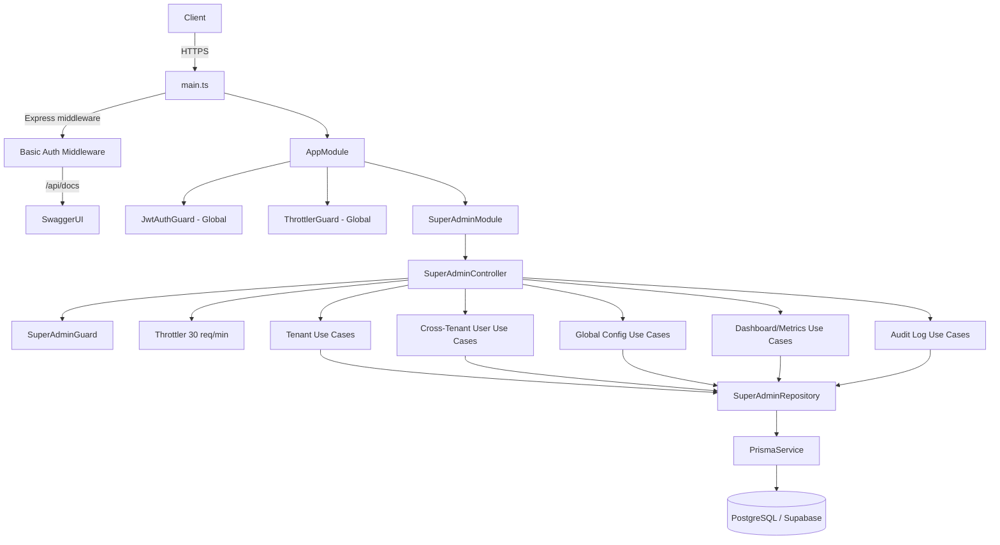
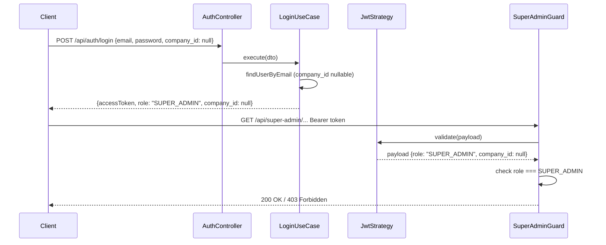

# Design Document — super-admin-control

## Overview

Esta feature introduce el rol `SUPER_ADMIN` en la plataforma multi-tenant de mensajería. El Super Admin opera por encima del aislamiento de tenant: gestiona empresas, usuarios cross-tenant, configuración global, métricas del sistema y auditoría de sus propias acciones.

El diseño se integra sobre la arquitectura NestJS DDD/Clean Architecture existente, añadiendo un módulo dedicado `SuperAdminModule` con su propio guard, throttling y prefijo de rutas. Los cambios al schema Prisma son mínimos y quirúrgicos para no romper el comportamiento multi-tenant existente.

### Decisiones de diseño clave

- **Tabla `User` unificada con `company_id` opcional**: En lugar de crear una tabla `SuperAdmin` separada, se hace `company_id` nullable en `User`. Esto simplifica el flujo de autenticación JWT existente (mismo `JwtStrategy`, mismo `LoginUseCase` con adaptación mínima) y evita duplicar lógica de tokens.
- **`Token.company_id` nullable**: Los tokens del Super Admin no pertenecen a ningún tenant; se hace el campo opcional para mantener la tabla unificada.
- **Guard a nivel de controlador**: `SuperAdminGuard` se aplica en el controlador, no globalmente, para no interferir con el `JwtAuthGuard` global.
- **HTTP Basic Auth como Express middleware**: La protección de Swagger se implementa como middleware Express puro en `main.ts`, antes de que NestJS procese la solicitud, garantizando que ningún guard o interceptor pueda bypassearlo.
- **Audit log best-effort**: Si la escritura en `AuditLog` falla, la operación principal no se interrumpe (se loguea el error). Esto evita que un fallo de auditoría bloquee operaciones críticas.

---

## Architecture



### Flujo de autenticación Super Admin



---

## Components and Interfaces

### Estructura de carpetas

```
src/modules/super-admin/
├── super-admin.module.ts
├── super-admin.controller.ts
├── application/
│   ├── dto/
│   │   ├── create-tenant.dto.ts
│   │   ├── update-tenant-status.dto.ts
│   │   ├── update-user-role.dto.ts
│   │   ├── update-user-status.dto.ts
│   │   ├── create-global-config.dto.ts
│   │   ├── update-global-config.dto.ts
│   │   ├── dashboard-metrics.dto.ts
│   │   └── audit-log-filter.dto.ts
│   └── use-cases/
│       ├── tenants/
│       │   ├── list-tenants.use-case.ts
│       │   ├── get-tenant-detail.use-case.ts
│       │   ├── create-tenant.use-case.ts
│       │   ├── suspend-tenant.use-case.ts
│       │   ├── reactivate-tenant.use-case.ts
│       │   └── delete-tenant.use-case.ts
│       ├── users/
│       │   ├── list-tenant-users.use-case.ts
│       │   ├── suspend-user.use-case.ts
│       │   ├── reactivate-user.use-case.ts
│       │   ├── change-user-role.use-case.ts
│       │   └── delete-user.use-case.ts
│       ├── config/
│       │   ├── list-global-config.use-case.ts
│       │   ├── create-global-config.use-case.ts
│       │   └── update-global-config.use-case.ts
│       ├── metrics/
│       │   ├── get-dashboard.use-case.ts
│       │   ├── get-tenant-metrics.use-case.ts
│       │   └── list-tenants-by-volume.use-case.ts
│       └── audit/
│           └── list-audit-log.use-case.ts
├── domain/
│   └── audit-log.service.ts
└── infrastructure/
    └── super-admin.repository.ts
```

### SuperAdminGuard

```typescript
// src/core/guards/super-admin.guard.ts
@Injectable()
export class SuperAdminGuard implements CanActivate {
  canActivate(context: ExecutionContext): boolean {
    const request = context.switchToHttp().getRequest();
    const user: JwtPayload = request.user;
    if (!user || user.role !== Role.SUPER_ADMIN) {
      throw new ForbiddenException('Acceso restringido a Super Admin');
    }
    return true;
  }
}
```

El guard se aplica a nivel de controlador con `@UseGuards(SuperAdminGuard)`. El `JwtAuthGuard` global ya habrá validado el token antes de que este guard se ejecute, por lo que si el token es inválido/ausente, el 401 lo emite el guard global.

### SuperAdminController (endpoints)

```
GET    /api/super-admin/tenants                    → listar tenants (paginado)
POST   /api/super-admin/tenants                    → crear tenant
GET    /api/super-admin/tenants/:id                → detalle tenant
PATCH  /api/super-admin/tenants/:id/suspend        → suspender tenant
PATCH  /api/super-admin/tenants/:id/reactivate     → reactivar tenant
DELETE /api/super-admin/tenants/:id                → eliminar tenant

GET    /api/super-admin/tenants/:id/users          → listar usuarios del tenant
PATCH  /api/super-admin/users/:id/suspend          → suspender usuario
PATCH  /api/super-admin/users/:id/reactivate       → reactivar usuario
PATCH  /api/super-admin/users/:id/role             → cambiar rol
DELETE /api/super-admin/users/:id                  → eliminar usuario

GET    /api/super-admin/config                     → listar config global
POST   /api/super-admin/config                     → crear config
PATCH  /api/super-admin/config/:key                → actualizar config

GET    /api/super-admin/dashboard                  → métricas globales
GET    /api/super-admin/tenants/:id/metrics        → métricas por tenant
GET    /api/super-admin/tenants/by-volume          → tenants por volumen

GET    /api/super-admin/audit-log                  → consultar audit log
```

### AuditLogService

Servicio de dominio que encapsula la escritura en `AuditLog`. Se inyecta en los use cases que realizan operaciones de escritura.

```typescript
interface AuditLogEntry {
  super_admin_id: string;
  action: string;           // e.g. 'DELETE_TENANT', 'SUSPEND_USER'
  entity_type: string;      // e.g. 'Company', 'User'
  entity_id: string;
  payload?: Record<string, unknown>;
  ip_address?: string;
}
```

### Swagger Basic Auth Middleware

Middleware Express puro registrado en `main.ts` antes del setup de Swagger:

```typescript
// Pseudocódigo — implementación en main.ts
if (swaggerEnabled) {
  app.use('/api/docs', (req, res, next) => {
    const b64 = (req.headers.authorization ?? '').split(' ')[1] ?? '';
    const [user, pass] = Buffer.from(b64, 'base64').toString().split(':');
    if (user === SWAGGER_USER && pass === SWAGGER_PASSWORD) return next();
    res.set('WWW-Authenticate', 'Basic realm="Swagger"');
    res.status(401).send('Unauthorized');
  });
}
```

---

## Data Models

### Cambios al schema Prisma

#### 1. Enum `UserRole` — agregar `SUPER_ADMIN`

```prisma
enum UserRole {
  SUPER_ADMIN
  ADMIN
  AUX
  COURIER
}
```

#### 2. Modelo `User` — `company_id` opcional

```prisma
model User {
  id            String     @id @default(uuid())
  company_id    String?                          // nullable para SUPER_ADMIN
  name          String     @db.VarChar(100)
  email         String     @db.VarChar(150)
  password_hash String
  role          UserRole
  status        UserStatus @default(ACTIVE)
  created_at    DateTime   @default(now())

  company              Company?               @relation(fields: [company_id], references: [id], onDelete: Cascade)
  courier              Courier?
  serviceStatusHistory ServiceStatusHistory[]
  tokens               Token[]

  @@unique([company_id, email])
  @@index([company_id])
  @@map("user")
}
```

> Nota: El `@@unique([company_id, email])` con `company_id` nullable permite múltiples Super Admins con el mismo email en distintos tenants, pero en la práctica el Super Admin no tiene tenant. La constraint sigue siendo válida porque `(null, email)` es único en PostgreSQL.

#### 3. Modelo `Token` — `company_id` opcional

```prisma
model Token {
  id         String    @id @default(uuid())
  company_id String?                          // nullable para tokens de SUPER_ADMIN
  user_id    String
  type       TokenType
  token_hash String
  used       Boolean   @default(false)
  expiration DateTime
  created_at DateTime  @default(now())

  company Company? @relation(fields: [company_id], references: [id], onDelete: Cascade)
  user    User     @relation(fields: [user_id], references: [id], onDelete: Cascade)

  @@index([user_id, company_id])
  @@map("token")
}
```

#### 4. Nuevo modelo `AuditLog`

```prisma
model AuditLog {
  id             String   @id @default(uuid())
  super_admin_id String
  action         String   @db.VarChar(100)
  entity_type    String   @db.VarChar(50)
  entity_id      String
  payload        Json?
  ip_address     String?  @db.VarChar(45)
  created_at     DateTime @default(now())

  super_admin User @relation("SuperAdminAuditLogs", fields: [super_admin_id], references: [id])

  @@index([super_admin_id])
  @@index([entity_type, entity_id])
  @@index([created_at(sort: Desc)])
  @@map("audit_log")
}
```

#### 5. Nuevo modelo `GlobalConfig`

```prisma
model GlobalConfig {
  id          String   @id @default(uuid())
  key         String   @unique @db.VarChar(100)
  value       String
  description String?
  updated_at  DateTime @updatedAt

  @@map("global_config")
}
```

### Cambios al tipo `JwtPayload`

```typescript
export interface JwtPayload {
  sub: string;
  email: string;
  role: Role;
  company_id: string | null;   // null para SUPER_ADMIN
  iat?: number;
  exp?: number;
}
```

### Enum `Role` actualizado

```typescript
export enum Role {
  SUPER_ADMIN = 'SUPER_ADMIN',
  ADMIN = 'ADMIN',
  AUX = 'AUX',
  COURIER = 'COURIER',
}
```

### Variables de entorno nuevas

```env
SWAGGER_ENABLED=true          # 'false' deshabilita /api/docs completamente
SWAGGER_USER=admin            # usuario para HTTP Basic Auth de Swagger
SWAGGER_PASSWORD=secret       # contraseña para HTTP Basic Auth de Swagger
```

Estas variables se añaden a `EnvVars` en `src/config/env.ts` con validación opcional (no requeridas en desarrollo si `SWAGGER_ENABLED=false`).

### Throttling del SuperAdminModule

Se añade un throttler nombrado `super-admin` en `AppModule`:

```typescript
ThrottlerModule.forRoot([
  { name: 'short',       ttl: 60_000, limit: 20 },
  { name: 'auth',        ttl: 60_000, limit: 10 },
  { name: 'super-admin', ttl: 60_000, limit: 30 },
])
```

El controlador usa `@Throttle({ 'super-admin': { limit: 30, ttl: 60000 } })` para aplicar el límite específico.

---

## Correctness Properties


*A property is a characteristic or behavior that should hold true across all valid executions of a system — essentially, a formal statement about what the system should do. Properties serve as the bridge between human-readable specifications and machine-verifiable correctness guarantees.*

### Property 1: JWT payload de SUPER_ADMIN

*For any* usuario con rol `SUPER_ADMIN` que se autentica exitosamente, el payload del JWT emitido debe contener `role = "SUPER_ADMIN"` y `company_id = null`.

**Validates: Requirements 1.2**

---

### Property 2: Guard rechaza roles no-SUPER_ADMIN

*For any* token JWT válido cuyo payload contenga un rol distinto de `SUPER_ADMIN` (es decir, `ADMIN`, `AUX` o `COURIER`), cualquier solicitud a cualquier endpoint del `Super_Admin_Module` debe retornar HTTP 403.

**Validates: Requirements 1.3, 7.2**

---

### Property 3: Guard permite SUPER_ADMIN sin verificar company_id

*For any* token JWT válido con `role = "SUPER_ADMIN"`, independientemente del valor de `company_id` (incluyendo `null`), el `SuperAdminGuard` debe permitir el acceso al endpoint solicitado.

**Validates: Requirements 1.6**

---

### Property 4: Creación de tenant con nombre válido retorna tenant con id

*For any* nombre de tenant válido (no vacío, no duplicado), una solicitud de creación debe retornar un objeto con un campo `id` no nulo y el nombre enviado.

**Validates: Requirements 2.2**

---

### Property 5: Nombre de tenant duplicado retorna 409

*For any* nombre de tenant que ya exista en la base de datos, un intento de crear un nuevo tenant con ese mismo nombre debe retornar HTTP 409.

**Validates: Requirements 2.3**

---

### Property 6: Round-trip suspend/reactivate de tenant

*For any* tenant activo, suspenderlo y luego reactivarlo debe restaurar el tenant a `status = true`, dejando el estado equivalente al estado previo a la suspensión.

**Validates: Requirements 2.4, 2.6**

---

### Property 7: Login rechazado para entidades suspendidas

*For any* usuario cuyo tenant tenga `status = false` o cuyo propio `status = SUSPENDED`, un intento de login debe retornar HTTP 403.

**Validates: Requirements 2.5, 3.3**

---

### Property 8: Eliminación de recurso registra en AuditLog

*For any* recurso (tenant o usuario) eliminado por el Super Admin, después de la operación debe existir exactamente un registro en `AuditLog` con `entity_type` y `entity_id` correspondientes al recurso eliminado.

**Validates: Requirements 2.7, 3.7**

---

### Property 9: Round-trip suspend/reactivate de usuario

*For any* usuario activo, suspenderlo y luego reactivarlo debe restaurar el usuario a `status = ACTIVE`.

**Validates: Requirements 3.2, 3.4**

---

### Property 10: Cambio de rol persiste el nuevo valor

*For any* usuario y cualquier valor de rol válido (distinto de `SUPER_ADMIN` si el usuario tiene `company_id` no nulo), actualizar el rol debe resultar en que el campo `role` del usuario en la base de datos sea igual al valor enviado.

**Validates: Requirements 3.5**

---

### Property 11: Asignar SUPER_ADMIN a usuario con tenant retorna 422

*For any* usuario que tenga `company_id` no nulo, un intento de asignarle el rol `SUPER_ADMIN` debe retornar HTTP 422.

**Validates: Requirements 3.6**

---

### Property 12: Actualización de GlobalConfig persiste valor y updated_at

*For any* clave de `GlobalConfig` existente y cualquier nuevo valor, actualizar la configuración debe persistir el nuevo valor y el campo `updated_at` debe ser mayor o igual al valor previo.

**Validates: Requirements 4.3**

---

### Property 13: Actualizar clave inexistente retorna 404

*For any* clave que no exista en `GlobalConfig`, un intento de actualización debe retornar HTTP 404.

**Validates: Requirements 4.4**

---

### Property 14: Crear GlobalConfig con key duplicada retorna 409

*For any* clave que ya exista en `GlobalConfig`, un intento de crear una nueva entrada con esa misma clave debe retornar HTTP 409.

**Validates: Requirements 4.6**

---

### Property 15: Métricas de tenant contienen campos requeridos

*For any* tenant con datos en la base de datos, la respuesta del endpoint de métricas de ese tenant debe contener los campos: servicios por estado del período, mensajeros activos y monto total liquidado en el período.

**Validates: Requirements 5.2**

---

### Property 16: AuditLog es inmutable vía API

*For any* registro en `AuditLog`, no debe existir ningún endpoint en el `Super_Admin_Module` que permita modificar o eliminar ese registro; cualquier intento de escritura sobre el AuditLog vía API debe retornar HTTP 404 o HTTP 405.

**Validates: Requirements 6.5**

---

### Property 17: SUPER_ADMIN no puede tener company_id no nulo

*For any* intento de crear o actualizar un usuario con `role = SUPER_ADMIN` y `company_id` no nulo, el sistema debe rechazar la operación con un error de validación (HTTP 422).

**Validates: Requirements 7.4**

---

### Property 18: Swagger con credenciales válidas concede acceso

*For any* par de credenciales que coincida exactamente con los valores de `SWAGGER_USER` y `SWAGGER_PASSWORD` del entorno, una solicitud a `/api/docs` con esas credenciales en HTTP Basic Auth debe retornar HTTP 200.

**Validates: Requirements 8.2**

---

### Property 19: Swagger con credenciales inválidas retorna 401

*For any* par de credenciales que no coincida con los valores de `SWAGGER_USER` y `SWAGGER_PASSWORD` (incluyendo credenciales ausentes), una solicitud a `/api/docs` debe retornar HTTP 401 con el header `WWW-Authenticate: Basic`.

**Validates: Requirements 8.3**

---

### Property 20: SWAGGER_ENABLED=false deshabilita el endpoint

*For any* solicitud a `/api/docs` cuando la variable de entorno `SWAGGER_ENABLED` tiene el valor `"false"`, el sistema debe retornar HTTP 404 independientemente de las credenciales proporcionadas.

**Validates: Requirements 8.5, 8.6**

---

## Error Handling

### Estrategia general

El módulo sigue el patrón de `AppException` ya establecido en el proyecto para errores de dominio con códigos HTTP específicos. Los errores de infraestructura (Prisma, red) se capturan y se transforman en respuestas HTTP apropiadas.

| Escenario | HTTP | Descripción |
|---|---|---|
| Token ausente o inválido | 401 | Manejado por `JwtAuthGuard` global |
| Rol no es SUPER_ADMIN | 403 | Manejado por `SuperAdminGuard` |
| Tenant no encontrado | 404 | `AppException` en use case |
| Usuario no encontrado | 404 | `AppException` en use case |
| GlobalConfig key no encontrada | 404 | `AppException` en use case |
| Nombre de tenant duplicado | 409 | `AppException` con `P2002` de Prisma |
| GlobalConfig key duplicada | 409 | `AppException` con `P2002` de Prisma |
| SUPER_ADMIN con company_id | 422 | Validación de dominio en use case |
| Rate limit excedido | 429 | `ThrottlerGuard` |
| Error interno | 500 | Filtro global de excepciones existente |

### Manejo de errores de Prisma

Los errores de constraint de Prisma (`P2002` para unique violation, `P2025` para record not found) se interceptan en el repositorio y se transforman en `AppException` con el código HTTP apropiado.

### Audit log best-effort

```typescript
// En AuditLogService
async log(entry: AuditLogEntry): Promise<void> {
  try {
    await this.prisma.auditLog.create({ data: entry });
  } catch (error) {
    this.logger.error('Failed to write audit log', { entry, error });
    // No re-throw: la operación principal no se interrumpe
  }
}
```

### Validación de SUPER_ADMIN sin tenant

La validación de que un usuario `SUPER_ADMIN` no puede tener `company_id` se realiza en el use case de cambio de rol, antes de persistir:

```typescript
if (dto.role === Role.SUPER_ADMIN && user.company_id !== null) {
  throw new AppException(
    'Los Super Admins no pueden pertenecer a un tenant',
    HttpStatus.UNPROCESSABLE_ENTITY,
  );
}
```

---

## Testing Strategy

### Enfoque dual: Unit tests + Property-based tests

Ambos tipos de tests son complementarios y necesarios:

- **Unit tests**: verifican ejemplos concretos, casos de borde y condiciones de error específicas.
- **Property tests**: verifican propiedades universales sobre rangos amplios de inputs generados aleatoriamente.

### Librería de property-based testing

Se usará **[fast-check](https://github.com/dubzzz/fast-check)** para TypeScript/Node.js. Es la librería más madura del ecosistema JS/TS para PBT.

```bash
npm install --save-dev fast-check
```

Cada property test debe ejecutarse con un mínimo de **100 iteraciones** (configurado via `{ numRuns: 100 }` en `fc.assert`).

### Estructura de tests

```
specs/
└── super-admin/
    ├── super-admin-guard.spec.ts          # Unit + Property tests del guard
    ├── tenants.use-case.spec.ts           # Unit + Property tests de tenants
    ├── users.use-case.spec.ts             # Unit + Property tests de usuarios
    ├── global-config.use-case.spec.ts     # Unit + Property tests de config
    ├── audit-log.service.spec.ts          # Unit + Property tests de auditoría
    ├── swagger-auth.middleware.spec.ts    # Unit + Property tests del middleware
    └── dashboard.use-case.spec.ts        # Unit tests de métricas
```

### Formato de tag para property tests

Cada property test debe incluir un comentario de referencia:

```typescript
// Feature: super-admin-control, Property 2: Guard rechaza roles no-SUPER_ADMIN
it('should return 403 for any non-SUPER_ADMIN role', () => {
  fc.assert(
    fc.property(
      fc.constantFrom(Role.ADMIN, Role.AUX, Role.COURIER),
      (role) => {
        // ...
      }
    ),
    { numRuns: 100 }
  );
});
```

### Unit tests — ejemplos y casos de borde

- Verificar que el enum `UserRole` incluye `SUPER_ADMIN`
- Verificar que el endpoint `/api/docs` sin credenciales retorna 401 con header `WWW-Authenticate`
- Verificar que el dashboard retorna la estructura de respuesta esperada
- Verificar que el endpoint de audit log existe y soporta filtros
- Verificar que el throttling de 30 req/min está configurado en el módulo
- Verificar que todos los endpoints del módulo están bajo `/api/super-admin/`
- Verificar que `AuditLog` no tiene endpoints de escritura expuestos

### Property tests — mapeo a propiedades del diseño

| Property | Test | Patrón PBT |
|---|---|---|
| P1: JWT payload SUPER_ADMIN | Generar usuarios SUPER_ADMIN aleatorios, verificar payload | Invariant |
| P2: Guard rechaza no-SUPER_ADMIN | Generar roles aleatorios ≠ SUPER_ADMIN, verificar 403 | Error conditions |
| P3: Guard permite SUPER_ADMIN | Generar payloads SUPER_ADMIN con company_id aleatorio | Invariant |
| P4: Creación tenant válido | Generar nombres válidos aleatorios, verificar id en respuesta | Round trip |
| P5: Nombre duplicado → 409 | Crear tenant, intentar crear con mismo nombre | Error conditions |
| P6: Round-trip suspend/reactivate tenant | Generar tenants, suspend→reactivate, verificar status | Round trip |
| P7: Login rechazado por suspensión | Generar usuarios/tenants suspendidos, verificar 403 | Invariant |
| P8: Eliminación registra AuditLog | Generar recursos, eliminar, verificar AuditLog | Round trip |
| P9: Round-trip suspend/reactivate usuario | Generar usuarios, suspend→reactivate, verificar ACTIVE | Round trip |
| P10: Cambio de rol persiste | Generar usuarios y roles válidos, verificar persistencia | Round trip |
| P11: SUPER_ADMIN con tenant → 422 | Generar usuarios con company_id, intentar asignar SUPER_ADMIN | Error conditions |
| P12: Update GlobalConfig persiste | Generar configs y valores, actualizar, verificar persistencia | Round trip |
| P13: Update key inexistente → 404 | Generar keys que no existen, verificar 404 | Error conditions |
| P14: Create key duplicada → 409 | Crear config, intentar crear con misma key | Error conditions |
| P15: Métricas contienen campos | Generar tenants con datos, verificar estructura de respuesta | Invariant |
| P16: AuditLog inmutable | Generar registros, verificar que no hay endpoints de escritura | Invariant |
| P17: SUPER_ADMIN sin company_id | Generar company_ids no nulos, verificar 422 | Error conditions |
| P18: Swagger credenciales válidas → 200 | Generar credenciales válidas, verificar 200 | Round trip |
| P19: Swagger credenciales inválidas → 401 | Generar credenciales inválidas, verificar 401 + header | Error conditions |
| P20: SWAGGER_ENABLED=false → 404 | Configurar flag, verificar 404 en cualquier solicitud | Invariant |
